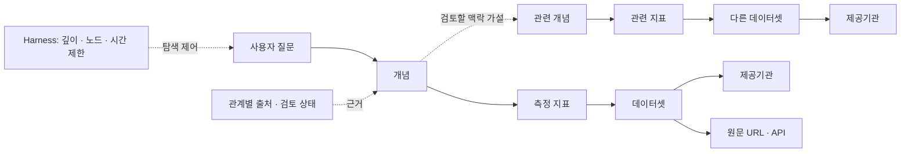

# 공공데이터 온톨로지 · Discovery Platform

**국내외 공공데이터의 의미와 관계를 연결하고, 관련 자료를 추천한 이유와 원문 출처를 보여주는 플랫폼의 프로토타입이다.** 대용량 원본 전체를 복제하는 대신 개념·지표·자료 메타데이터·관계·출처를 축적한다.

현재 공유 버전은 **v0.3 / 2026-09-12**다. 자유로운 자연어 검색 서비스나 실제 통계 분석을 실행하는 제품은 아직 아니며, 3개 질문 예시로 관계 탐색과 자원 제한을 검증한다.

## 팀원이 먼저 볼 것

1. **[팀 공유 안내](docs/team-guide.md)** — 제품 정의, 용어, 역할별 작업과 다음 단계.
2. **[인터랙티브 지식그래프](docs/ontology-explorer.html)** — 내려받아 브라우저로 열기. 질문·탐색 깊이·노드 한도를 바꾸고 각 연결의 근거를 확인한다.
3. **[설계서](ontology-prototype/discovery-platform/architecture.md)** — 데이터 구조와 AI·Harness·운영 설계.
4. **[관계 모델](ontology-prototype/discovery-platform/model.json)** / **[탐색 결과](ontology-prototype/discovery-platform/example-results.json)** — 기계가 사용하는 개체, 관계, 추천 경로.
5. **[국내 제공처 조사 목록](ontology-prototype/national-catalog/portal-registry.md)** — 제공처와 검토 상태.

GitHub의 HTML 파일 화면은 소스 보기다. 이 브랜치에서 **Code → Download ZIP** 후 압축을 풀고 `docs/ontology-explorer.html`을 열면 설치·로그인·API 키 없이 그래프가 실행된다. 원문 출처 링크를 열 때만 인터넷이 필요하다.

## 어떤 구조인가



예를 들어 ‘청년 인구 유출’에서 인구이동 자료를 찾고, 고용·주거 같은 관련 개념으로 탐색을 넓힌다. **‘관련해서 찾아볼 만하다’는 가설과 ‘실제로 통계적 상관이 있다’는 분석 결과는 구분한다.** 현재 상관계수·인과관계를 계산하거나 확정한 자료는 없다.

## 현재 확인한 범위

| 구분 | 이번 저장소의 상태 |
|---|---|
| 서비스 목표 | 국내외 공공데이터 전 분야를 수용하는 공통 구조 |
| 제공처 조사 | 국내 122개 조사 항목 + OECD·World Bank 2개 = 124개 항목. 전체 포털 수 또는 전체 연동 완료 수가 아님 |
| 질문 예시 | 청년 인구 유출·청년 고용·주거의 3개 예시 |
| 관계 모델 | 전체 25개 노드·31개 관계, 자료 후보 6개 |
| 기본 질문 결과 | 깊이 2에서 23개 노드·27개 관계·자료 후보 6개 |
| 실제 구현 | JSON 관계 모델, RDF 내보내기, 제한된 그래프 탐색, 추천 경로·근거, 지식그래프 |
| 설계 단계 | 외부 LLM, FastAPI, PostgreSQL, 컨테이너 자원 제한, 영속 감사 기록 |
| 미실행 | 실제 LLM 호출·AWS 배포·원본 데이터 결합·통계적 상관분석·거래 |

자료 설명을 확인했더라도 적합한 연령·지역·기간·계열과 결합 가능성은 별도 검증이 필요하다. OECD의 일부 기본 조회 조건은 청년 지표와 다르며, 졸업 후 이동·NEET의 적절한 자료 대응은 미해결 상태로 남겨 두었다. 라이선스와 개인정보 검증도 자동 승인으로 취급하지 않는다.

## 개발자가 실행하기

Python 3.10 이상과 `rdflib`가 필요하다. 이 공유본은 Python 3.14에서 검증했다. 프로젝트 루트에서 실행한다.

```bash
python -m venv .venv
```

Windows PowerShell:

```powershell
.venv/Scripts/python.exe -m pip install -r ontology-prototype/requirements.txt
.venv/Scripts/python.exe ontology-prototype/discovery-platform/validate.py
.venv/Scripts/python.exe ontology-prototype/discovery-platform/explore.py
```

macOS / Linux:

```bash
.venv/bin/python -m pip install -r ontology-prototype/requirements.txt
.venv/bin/python ontology-prototype/discovery-platform/validate.py
.venv/bin/python ontology-prototype/discovery-platform/explore.py
```

실행 환경을 활성화한 뒤 다음 명령으로 모델과 공유용 그래프를 다시 만들 수 있다.

```bash
python ontology-prototype/discovery-platform/build_model.py
python ontology-prototype/discovery-platform/explore.py
python ontology-prototype/discovery-platform/validate.py
python scripts/build_shared_graph.py
```

이 명령들은 저장된 근거를 사용하며 외부 데이터나 LLM을 호출하지 않는다. 실제 외부 요청을 수행하는 `collect_sources.py` 등 조사 도구는 별도 실행 항목이다.

## 저장소 구성

```text
docs/                               팀 공유 안내와 설치 없이 보는 그래프
scripts/build_shared_graph.py       공유용 그래프 재생성
scripts/standalone.template.html    독립 실행용 스타일·탭 동작 포함 템플릿
ontology-prototype/
  discovery-platform/               v0.3 최신 모델·탐색·설계·근거
  national-catalog/                 v0.2 국내 제공처 조사와 공통 온톨로지
  model.json, build.py, ...         v0.1 초기 예시 — 최신 모델과 구분
```

데이터 조사 스냅샷과 검토 기록은 포함하고, 로컬 설치 라이브러리·가상환경·개인 설정·비밀 키는 공유 대상에서 제외한다. 코드의 공개 재사용 라이선스는 아직 지정하지 않았으며, 원자료의 사용 조건은 각 출처에 따른다.
