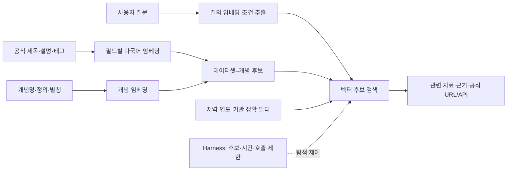

# 공공데이터 온톨로지 · Discovery Platform

**국내 공공데이터의 의미와 관계를 연결하고, 관련 자료를 추천한 이유와 원문 출처를 보여주는 플랫폼의 프로토타입이다.** 대용량 원본 전체를 복제하는 대신 개념·지표·자료 메타데이터·관계·출처를 축적한다.

## 현재 제품 방향 — 메타데이터 의미 검색

2026-09-17부터 제품의 기본 검색 구조를 **공식 제목·설명·태그의 다국어 임베딩 + 온톨로지 개념 정의 + 지역·연도·기관 등의 정확 필터**로 정리했다. 플랫폼은 원본 전체를 보관하거나 모든 개념 관계를 상관분석으로 증명하는 시스템이 아니라, 메타데이터를 바탕으로 관련 자료를 찾고 공식 페이지·API·다운로드 경로로 연결하는 시스템이다.

세부 구조, 관계 유형, 평가셋과 검색 성능 검증 방법은 **[메타데이터 의미 검색 중심 구조 v0.5](docs/metadata-semantic-retrieval-v0.5.md)**에서 확인한다. 기존 지식그래프와 상관분석 산출물은 각각 개념 탐색 데모와 후속 분석 사례로 보존하며, 새 검색 관계의 정답으로 자동 승격하지 않는다.

## 최신 전체 지식 그래프 — 바로 공유하기

**[로그인 없이 전체 지식 그래프 열기](https://chlsuun.github.io/public-data-ontology/)** · **[공유 범위와 사용 안내](docs/graph-sharing.md)** · **[코드·설계서 브랜치](https://github.com/chlsuun/public-data-ontology/tree/codex/ontology-collection-share-20260915)**

2026-09-15 공유 그래프 스냅샷에는 **수집 포털 34곳, 공통 개념 초안 88개, 포털–개념 연결 후보 434쌍**이 있다. 등록 자료 441,291건과 원문 항목 4,326,218개를 표본 제한 없이 함께 공유하며, 포털 → 등록 자료 → 원문 항목 → 공통 개념 순서로 근거를 확인한다. 의미 연결은 사람의 검토 전 후보이며 통계적 상관관계를 계산한 결과가 아니다.

GitHub Pages에서 현재 필터와 페이지의 주소를 복사하면 팀원도 같은 화면을 볼 수 있다. 수집 종료 시점의 등록정보와 명세를 반영한 고정 스냅샷이다. **[최종 수집 현황·종료 판단·다음 작업](https://chlsuun.github.io/public-data-ontology/collection.html)**도 함께 공유할 수 있다.

**현재 작업: [국내 포털·기관·칼럼 수집 v0.5](ontology-prototype/domestic-catalog/README.md)** — 국내 전 분야를 대상으로 공식 전체 목록과 공개 칼럼 명세를 수집했다. [현재 국내 model.json](ontology-prototype/domestic-catalog/model.json), [포털별 수집 상태](ontology-prototype/domestic-catalog/portal-coverage.md), 검색 화면 실행 안내를 여기에서 확인한다. 전체 국내 포털·칼럼 수집 완료는 아니며, 출처별 확보량과 미수집 범위를 명시한다. 아래 v0.3 데모의 해외 자료는 과거 설계 예시다.

아래의 **v0.3 / 2026-09-12 자료는 초기 설계 데모**다. 자유로운 자연어 검색 서비스나 실제 통계 분석을 실행하는 제품은 아직 아니며, 초기 데모에서는 3개 질문 예시로 관계 탐색과 자원 제한을 검증했다.

**다음 단계 설계: [v0.4 과정 확충안](docs/process-v0.4.md)** — 사람의 관계 검토, 사이트별 데이터 QA, 자료 중심 커뮤니티, 대용량 데이터의 부분 제공 과정을 구체화했다. [검토 작업 준비 도구](ontology-prototype/governance/README.md)는 기존 관계 31개와 자료 6개를 검토 대기열로 가져오며, 미검증 관계를 승인하거나 실제 품질 점수를 만들어 넣지 않는다. 기존 그래프는 v0.3 탐색 데모다.

## 팀원이 먼저 볼 것

1. **[팀 공유 안내](docs/team-guide.md)** — 제품 정의, 용어, 역할별 작업과 다음 단계.
2. **[최신 전체 지식 그래프](https://chlsuun.github.io/public-data-ontology/)** — 링크로 바로 열기. 포털·개념을 선택하고 원문 출처와 개념 연결 후보를 확인한다. [v0.3 그래프](docs/ontology-explorer.html)는 과거 질문 예시다.
3. **[설계서](ontology-prototype/discovery-platform/architecture.md)** — 데이터 구조와 AI·Harness·운영 설계.
4. **[관계 모델](ontology-prototype/discovery-platform/model.json)** / **[탐색 결과](ontology-prototype/discovery-platform/example-results.json)** — 기계가 사용하는 개체, 관계, 추천 경로.
5. **[국내 제공처 조사 목록](ontology-prototype/national-catalog/portal-registry.md)** — 제공처와 검토 상태.

GitHub의 HTML 파일 화면은 소스 보기다. 이 브랜치에서 **Code → Download ZIP** 후 압축을 풀고 `docs/ontology-explorer.html`을 열면 설치·로그인·API 키 없이 그래프가 실행된다. 원문 출처 링크를 열 때만 인터넷이 필요하다.

그래프를 공유할 때는 [웹 실행 링크](https://chlsuun.github.io/public-data-ontology/)를, 코드를 공유할 때는 [현재 작업 브랜치 링크](https://github.com/chlsuun/public-data-ontology/tree/codex/ontology-collection-share-20260915)를 사용한다. 저장소는 공개 상태로, 로그인 없이 열 수 있다.

## 어떤 구조인가


```mermaid
flowchart LR
  M[공식 제목·설명·태그] --> E[필드별 다국어 임베딩]
  C[개념명·정의·별칭] --> CE[개념 임베딩]
  E --> L[데이터셋–개념 후보]
  CE --> L
  Q[사용자 질문] --> QE[질의 임베딩·조건 추출]
  QE --> R[벡터 후보 검색]
  L --> R
  F[지역·연도·기관 정확 필터] --> R
  R --> U[관련 자료·근거·공식 URL/API]
  H[Harness: 후보·시간·호출 제한] -. 탐색 제어 .-> R
```

예를 들어 ‘청년 인구 유출’이라는 질문은 다국어 의미 검색으로 인구이동·전입·전출 자료 후보를 찾고, 지역·연도·연령 조건을 별도 필터로 확인한다. 고용·주거 자료가 함께 검색되더라도 이는 메타데이터 의미 연결 후보이며 통계적 상관이나 인과관계 확정을 뜻하지 않는다.

## 현재 확인한 범위

| 구분 | 이번 저장소의 상태 |
|---|---|
| 서비스 목표 | 현재 국내 공공데이터 전 분야. 아래 수량은 기존 v0.3 공유 데모의 기록 |
| 제공처 조사 | 국내 122개 조사 항목 + OECD·World Bank 2개 = 124개 항목. 전체 포털 수 또는 전체 연동 완료 수가 아님 |
| 질문 예시 | 청년 인구 유출·청년 고용·주거의 3개 예시 |
| 관계 모델 | 전체 25개 노드·31개 관계, 자료 후보 6개 |
| 기존 질문 데모 | 깊이 2에서 23개 노드·27개 관계·자료 후보 6개 |
| 실제 구현 | 메타데이터 수집, JSON 관계 모델, RDF 내보내기, 제한된 그래프 탐색, 지식그래프 |
| 새로 확정한 설계 | 제목·설명·공식 태그의 필드별 다국어 임베딩, 개념 정의 연결, 정확 조건 필터, 검색 평가·감사 구조 |
| 미실행 | 실제 임베딩 색인과 검색 평가, 자유 질의 API, AWS 배포, 거래 |

자료 설명을 확인했더라도 적합한 연령·지역·기간·계열과 결합 가능성은 별도 검증이 필요하다. OECD의 일부 기본 조회 조건은 청년 지표와 다르며, 졸업 후 이동·NEET의 적절한 자료 대응은 미해결 상태로 남겨 두었다. 라이선스와 개인정보 검증도 자동 승인으로 취급하지 않는다.

## 개발자가 실행하기

Python 3.10 이상과 `rdflib`가 필요하다. 이 공유본은 Python 3.14에서 검증했다. 프로젝트 루트에서 실행한다.

```bash
python -m venv .venv
```

Windows PowerShell:

```powershell
.venv/Scripts/python.exe -m pip install -r ontology-prototype/requirements.txt
.venv/Scripts/python.exe ontology-prototype/discovery-platform/validate.py
.venv/Scripts/python.exe ontology-prototype/discovery-platform/explore.py
```

macOS / Linux:

```bash
.venv/bin/python -m pip install -r ontology-prototype/requirements.txt
.venv/bin/python ontology-prototype/discovery-platform/validate.py
.venv/bin/python ontology-prototype/discovery-platform/explore.py
```

실행 환경을 활성화한 뒤 다음 명령으로 모델과 공유용 그래프를 다시 만들 수 있다.

```bash
python ontology-prototype/discovery-platform/build_model.py
python ontology-prototype/discovery-platform/explore.py
python ontology-prototype/discovery-platform/validate.py
python scripts/build_shared_graph.py
```

이 명령들은 저장된 근거를 사용하며 외부 데이터나 LLM을 호출하지 않는다. 실제 외부 요청을 수행하는 `collect_sources.py` 등 조사 도구는 별도 실행 항목이다.

## 저장소 구성

```text
docs/                               팀 공유 안내와 설치 없이 보는 그래프
scripts/build_shared_graph.py       공유용 그래프 재생성
scripts/standalone.template.html    독립 실행용 스타일·탭 동작 포함 템플릿
ontology-prototype/
  discovery-platform/               v0.3 최신 모델·탐색·설계·근거
  national-catalog/                 v0.2 국내 제공처 조사와 공통 온톨로지
  model.json, build.py, ...         v0.1 초기 예시 — 최신 모델과 구분
```

데이터 조사 스냅샷과 검토 기록은 포함하고, 로컬 설치 라이브러리·가상환경·개인 설정·비밀 키는 공유 대상에서 제외한다. 코드의 공개 재사용 라이선스는 아직 지정하지 않았으며, 원자료의 사용 조건은 각 출처에 따른다.
