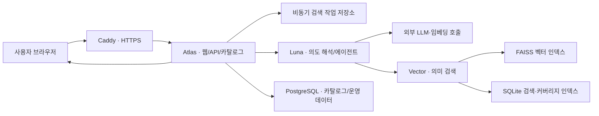

# 데이터이음 운영 구조 및 진행 상태 점검

점검일: 2026-10-04

## 현재 서비스의 성격

데이터이음은 현재 **국내외 공공데이터 포털의 메타데이터를 모아 자연어와 온톨로지로 탐색하고, 원문 제공 페이지까지 연결하는 서비스**로 구현되어 있다.

실제 관측값을 내려받아 조인하고 상관분석까지 수행하는 분석 엔진은 아직 주 검색 흐름에 연결되지 않았다. 따라서 현재 결과가 증명하는 것은 "이 자료가 질문과 관련되어 보이며 조건을 충족한다는 메타데이터 근거"이고, 변수 간 통계적 관계 자체는 아니다.

## 확인한 운영 규모

- 등록 메타데이터: 3,792,315건
- 등록 제공처: 약 40곳
- 대분류: 18개와 주제 미지정
- 주요 국내 제공처: 공공데이터포털, 서울 열린데이터광장, KOSIS, ECOS, SGIS, HIRA, VWorld, 문화데이터광장과 여러 광역자치단체 포털
- 주요 해외 제공처: World Bank, OECD, WHO, 미국 Data.gov, data.europa.eu, 영국, 프랑스, 호주, 일본, 대만 등
- 사용자 화면: 주제 지도, 목록, 제공 사이트, 필터, 상세 메타데이터, 비교 담기, 저장 자료, AI 데이터 찾기

## 운영 구조



서버는 역할별 컨테이너로 분리되어 있다.

| 구성 | 역할 | 현재 관찰된 자원 한도 |
|---|---|---:|
| Atlas | 웹 화면, API, 카탈로그 조회, 검색 작업 관리 | 2 GiB |
| Luna | 의도 추출, LangGraph 흐름, 결과 적합성 판정 | 1.5 GiB |
| Vector | 약 381만 벡터의 FAISS·SQLite 검색 | 3 GiB, 1.5 CPU |
| PostgreSQL | 카탈로그와 운영 데이터 저장 | 약 1.17 GiB |
| Caddy | 공개 HTTPS 진입점 | 별도 프록시 컨테이너 |

이 구조는 LLM과 상태를 한 프로세스 메모리에 계속 보관하지 않는다. 검색 작업은 SQLite 작업 큐에 저장하고, 카탈로그는 PostgreSQL/SQLite, 의미 벡터는 FAISS에 분리했다. 처음 논의했던 **외부 추론 + 상태 분리 + 제한된 에이전트** 방향이 실제 운영 구조에 반영되어 있다.

## 자연어 검색의 실제 처리 과정

1. 사용자의 문장에서 지표, 대상, 지역, 기간, 형식 조건을 추출한다.
2. 여러 지표를 `needs` 배열로 분리한다.
3. 검색 의미를 임베딩으로 변환한다.
4. 지역·기간 커버리지 필터를 적용해 벡터 후보를 찾는다.
5. LLM이 후보 제목·설명과 요청 지표의 의미 적합성을 다시 판정한다.
6. 검증된 메타데이터와 공식 원문 링크를 사용자에게 보여준다.
7. 관련 개념 자료는 별도 추천한다.

의도 추출 단계는 여러 지표를 이미 지원한다. 이번 복합 질문은 내부적으로 다음과 같이 정확히 분해됐다.

```text
질문: 2015년부터 2024년까지 서울의 청년 인구와 청년 실업률을
      연도별로 함께 비교할 수 있는 자료를 찾아줘

요청 1: employment / 대상=청년 실업률 / 지역=서울특별시
요청 2: population / 대상=청년 / 지역=서울특별시
공통 조건: 대한민국 / 2015~2024년 연속 기간
```

## 실제 동작 확인 결과

### 정상 동작

- 일반 검색어 `인구감소`는 83건을 반환했다.
- 상세 화면은 제공 포털, 제공기관, 형식, 갱신연도, 원문 링크, 자동 연결 개념을 표시했다.
- 단일 자연어 질문 `서울 청년 실업률 자료를 찾아줘`는 서울 열린데이터광장과 공공데이터포털의 청년 고용지표를 찾았다.
- 복합 질문의 의도 추출은 청년 인구와 청년 실업률을 서로 다른 요청으로 정확히 분리했다.
- 최근 단일 검색 작업은 약 18초, 복합 검색 작업은 약 20초에 완료됐다.

### 확인된 문제

1. **복합 지표의 거짓 완료 표시**
   - 복합 질문에서 KOSIS의 청년 인구 자료만 검증됐다.
   - 청년 실업률 자료는 결과에 없었지만 전체 상태가 `results`로 표시됐다.
   - 원인은 검색 후보를 하나의 결합 임베딩으로 찾고, 결과 조립기가 한 지표만 통과해도 전체 요청을 성공 처리하기 때문이다.

2. **포털 간 동일 원자료 중복**
   - 서울 열린데이터광장과 공공데이터포털에 등록된 동일한 청년 고용지표가 별도 자료처럼 노출됐다.
   - 원문 기관·통계표 ID·공식 URL을 이용한 대표 자료 묶음이 필요하다.

3. **콜드 검색 타임아웃**
   - 최초 의미 검색 한 건이 7초 데이터베이스 제한을 넘겨 504로 실패했다.
   - 벡터 서비스 지표상 18회 중 1회 타임아웃이었고, 재시도 후 검색은 정상 완료됐다.
   - 14 GB 카탈로그 DB와 32 GB 임베딩 DB의 차가운 페이지를 읽을 때 현재 7초 제한이 빠듯하다.

4. **아직 통계 분석까지 연결되지 않음**
   - 검색 결과는 공식 데이터 페이지를 추천한다.
   - 실제 값 수집, 변수 정의 정렬, 공간·기간 정합성 검사, 상관계수와 시차 분석, 결과 근거 저장은 별도 단계로 남아 있다.

## 이번에 준비한 수정안

첫 번째 문제를 막는 최소 수정안을 만들었다. 복합 질문에서는 요청 지표별 그룹을 반드시 만들고, 하나라도 검증 자료가 비면 전체 상태를 `partial`로 표시한다.

예상 표시:

```text
청년 인구: 검증 자료 1건
청년 실업률: 검증 자료 0건
상태: 일부만 확인됨
```

수정 파일:

- `candidate/discovery_harness/similarity_results.py`
- `candidate/discovery_harness/site_search.py`
- `candidate/test_multi_need_completeness.py`

서버에서 현재 Luna 이미지를 기반으로 후보 이미지를 빌드했다.

- 이미지 태그: `dataieum-multi-need-completeness:20261004-r1`
- 이미지 ID: `sha256:c14ce9924c1fc265046b87373dae8eca1d43666232399a3b0917284fa190426b`
- 검증: 한 지표만 있으면 `partial`, 두 지표가 모두 있으면 `results`가 되는 테스트 통과
- 운영 반영 상태: 미반영

이 수정은 없는 자료를 만들어 내지 않는다. 현재 결과의 완전성만 정직하게 표시한다.

## 다음 구현 순서

1. 이번 완전성 수정안을 운영 Luna에 반영하고 동일 복합 질문으로 회귀 검증한다.
2. 복합 질문을 지표별 검색어와 임베딩으로 분리해 각 지표 후보를 별도로 확보한다.
3. 지표별 결과를 하나의 데이터 묶음으로 조립하되 기간, 지역단위, 연령정의, 단위, 조사방식, 라이선스 호환성을 표로 표시한다.
4. 동일 원자료의 포털별 미러를 하나의 대표 자료로 묶고 제공처 목록만 병기한다.
5. 공식 원자료의 실제 관측값을 수집한 뒤 조인 가능성 검사를 통과한 조합에만 상관분석을 수행한다.
6. 분석 결과에는 사용 변수, 공간·기간 단위, 표본 수, 결측 처리, 상관계수, 유의확률, 시차, 인과 해석 금지 문구와 출처를 함께 저장한다.

이 순서로 진행하면 데이터이음은 단순 추천 화면에서 **질문을 데이터 조합으로 바꾸고, 조합 가능성과 통계 근거를 함께 제시하는 온톨로지 기반 분석 준비 플랫폼**으로 이어진다.
