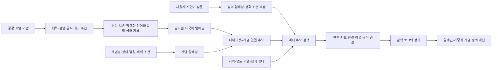

# 메타데이터 의미 검색 중심 구조 v0.5

작성일: 2026-09-17
상태: 합의된 제품 방향을 구현 구조와 검증 기준으로 구체화한 설계

## 1. 제품의 중심

데이터이음은 공공데이터 원본 전체를 보관하는 저장소가 아니다. 공공기관이 공개한 **제목·설명·공식 태그와 구조화된 조건**을 수집하고, 이를 이용해 자료가 무엇을 다루는지 연결한 뒤 사용자가 공식 상세 페이지·API·다운로드 경로를 찾도록 돕는 검색 플랫폼이다.

제목은 핵심 대상을 짧게 표현하고, 설명은 대상·범위·측정 내용·이용 맥락을 보완하며, 공식 태그는 포털의 검색·분류 단서를 제공한다. 세 필드는 자료의 의미를 추정할 근거지만 정답 자체는 아니다. 오류·누락·관행적 태그가 있을 수 있으므로 원문, 수집 시각, 제공처, 필드별 존재 여부와 함께 보존한다.

이 구조에서 온톨로지는 모든 데이터의 상관관계를 미리 증명한 그래프가 아니다. **검색할 주제의 정의와 상하위·관련 개념을 관리하고, 데이터셋 메타데이터가 어떤 개념과 가까운지 설명하는 의미 계층**이다.

## 2. 바뀐 전체 흐름

기존의 `AI가 관계 후보 제안 → 모든 후보를 상관분석 → 확정 관계`는 기본 검색 과정으로 사용하지 않는다. 새 기본 과정은 다음과 같다.

1. 공식 메타데이터 원문과 출처 버전을 수집한다.
2. 제목·설명·공식 태그를 필드별로 정규화하고 다국어 임베딩을 만든다.
3. 데이터셋 벡터를 개념 정의 벡터와 비교해 복수의 개념 연결 후보를 만든다.
4. 사용자 질문 벡터로 데이터셋과 개념 후보를 검색한다.
5. 연도·지역·기관·자료 형식처럼 정확해야 하는 조건은 구조화 필터로 적용한다.
6. 관련 자료, 사용한 메타데이터, 필터 결과, 공식 상세·다운로드 경로를 반환한다.
7. 정답셋을 이용해 검색·분류 성능을 측정하고 임계값과 결합 방식을 고친다.

## 3. 저장할 의미와 관계의 종류

| 구분 | 뜻 | 생성 방식 | 검색에서의 사용 |
|---|---|---|---|
| `semantic_candidate` | 메타데이터와 개념 정의의 벡터가 가까움 | 모델·전처리·점수·임계값과 함께 자동 생성 | 후보 검색에 사용하며 자동 사실로 표시하지 않음 |
| `validated_topic` | 평가셋 또는 검토에서 자료가 해당 주제를 다룬다고 확인 | 검토자·판정 기준·적용 버전 기록 | 주제 검색의 확정 연결로 사용 |
| `broader / narrower / related` | 개념 사이의 상하위·관련 의미 | 개념 사전에서 편집·검토 | 질의 확장에 제한적으로 사용 |
| `listed_at / provided_by / official_access` | 등록 포털·제공기관·공식 접근 경로 | 공식 등록정보로 확인 | 결과의 출처와 이동 경로에 사용 |
| `statistical_association` | 특정 원자료·지역·기간·방법에서 관찰된 수치 관계 | 별도의 재현 가능한 분석 | 검색 관계와 분리해 후속 분석 근거로만 표시 |

사용자 질문과 검색 결과의 연결은 해당 요청의 `RetrievalRun`에 기록한다. 한 번 검색됐다는 이유로 영구 온톨로지 관계가 되지 않는다. 통계적 상관도 개념의 의미 동일성, 검색 적합성, 인과관계를 대신하지 않는다.

## 4. 임베딩 입력과 버전 관리

세 필드를 한 문장으로 합친 벡터 하나만 저장하면 어느 근거가 검색에 기여했는지 알기 어렵고, 긴 설명이 짧은 제목·태그를 덮을 수 있다. 따라서 기본 저장 단위는 필드별 벡터다.

| 입력 | 저장 내용 | 처리 원칙 |
|---|---|---|
| 제목 | `title_raw`, `title_normalized`, 제목 벡터 | 기관이 제공한 제목을 보존하고 핵심 검색 신호로 사용 |
| 설명 | `description_raw`, `description_normalized`, 설명 벡터 | HTML·제어문자만 정리하고 없는 내용을 생성하지 않음 |
| 공식 태그 | `keywords_raw`, 정규화된 태그 목록, 태그 벡터 | 프로젝트가 만든 태그와 기관 공식 태그를 구분 |
| 개념 | 개념명·정의·별칭·포함 예·배제 예, 개념 벡터 | 정의 변경 시 새 버전 생성 |
| 질문 | 원질문 해시, 질의 벡터, 추출한 정확 조건 | 개인정보가 포함될 수 있는 원문 보존은 별도 정책 적용 |

각 임베딩에는 `embedding_model_id`, 모델 리비전, 차원, 거리 함수, 전처리 버전, 입력 필드, 입력 내용 해시, 생성 시각을 저장한다. 메타데이터나 개념 정의가 달라지면 영향받는 벡터만 다시 만든다. 서로 다른 모델 버전의 벡터를 같은 인덱스에서 직접 비교하지 않는다.

공식 태그가 없어도 제목이나 설명이 유효하면 색인한다. 설명도 거의 없고 제목이 지나치게 일반적이면 임의로 의미를 채우지 않고 `insufficient_metadata`로 표시해 낮은 우선순위 또는 보류 대상으로 둔다.

## 5. 검색과 점수 결합

온라인 검색은 두 종류의 후보를 함께 사용한다.

- 질문과 제목·설명·태그의 직접 의미 유사도
- 질문과 가까운 개념을 거쳐 연결된 데이터셋 후보

필드별 점수는 사용 가능한 필드만으로 결합한다. 초기 가중치는 구현을 시작하기 위한 값일 뿐 정확성 근거가 아니며, 제목만 검색·제목과 설명·제목과 설명과 태그·개념 경유 검색을 같은 평가셋에서 비교해 결정한다. 최종 점수와 함께 필드별 점수, 개념 경유 여부, 사용한 모델 버전을 남긴다.

지역·연도·기관·제공 형식·라이선스 상태는 벡터 유사도로 판정하지 않는다. 질의에서 조건을 추출한 뒤 정규화된 필드와 정확히 비교한다.

- 조건이 일치하면 통과한다.
- 메타데이터에 값이 없으면 `unknown`으로 표시한다.
- 조건과 충돌하면 제외한다.
- 지역명 별칭이나 기관명 변경은 버전이 있는 코드·대응표로 처리한다.
- 의미 점수가 높아도 필수 조건이 충돌하면 추천하지 않는다.

복수 주제 자료는 임계값을 통과한 여러 `semantic_candidate`를 가질 수 있다. 다만 서로 비슷한 상위·하위 개념이 무제한으로 붙지 않도록 최대 개수, 최소 점수, 1위와의 점수 차이, 개념 계층 중복 제거 규칙을 평가로 정한다. 기준 이하에서는 억지로 한 개념을 고르지 않고 보류한다.

## 6. 사용자에게 보여줄 근거

벡터 자체는 사람이 읽을 수 있는 설명이 아니다. 검색 결과에는 다음을 함께 표시한다.

1. 공식 제목과 제공기관
2. 검색에 사용한 공식 설명의 짧은 원문 부분과 공식 태그
3. 연결한 개념과 연결 상태: 후보 또는 검증됨
4. 지역·기간·기관·형식 필터의 일치·불일치·미확인 상태
5. 공식 상세 페이지, API 문서, 다운로드 주소
6. 임베딩 모델·메타데이터 버전과 검색 시각을 찾을 수 있는 결과 ID

“AI가 이해했기 때문에 관련 있다”는 문구를 근거로 사용하지 않는다. 결과 이유는 공식 메타데이터와 적용한 조건으로 재확인할 수 있어야 한다.

## 7. 실제 성능 검증

검증 대상은 상관계수가 아니라 **관련 자료를 찾아내고 올바른 주제로 분류하는 성능**이다.

### 평가셋

- 국내외 여러 포털과 인구·교통·고용·환경·보건 등 여러 분야를 포함한다.
- 한국어·영어·혼합 언어 질문을 포함한다.
- 태그가 있는 자료와 없는 자료, 설명이 긴 자료와 짧은 자료를 나눈다.
- 같은 자료의 중복 등록이 학습·튜닝·평가에 나뉘어 들어가지 않도록 원자료 계열 단위로 분리한다.
- 질문별 관련 자료는 2명이 독립 판정하고 이견과 판단 근거를 남긴다.
- 관련 자료가 실제로 없는 질문과 필수 조건이 충돌하는 질문도 포함한다.

### 비교 실험

| 실험 | 확인할 것 |
|---|---|
| 제목 키워드 검색 | 기존 방식의 기준선 |
| 제목 임베딩 | 다국어 의미 검색의 최소 효과 |
| 제목+설명 임베딩 | 설명 추가가 검색을 개선하는지 |
| 제목+설명+태그 | 공식 태그의 추가 가치와 잘못된 태그의 영향 |
| 개념 정의 경유 | 온톨로지가 직접 벡터 검색보다 도움이 되는지 |
| 의미 검색+정확 필터 | 지역·기간·기관 조건 오류를 줄이는지 |

검색 평가는 `Recall@5/10`, `Precision@5`, `nDCG@10`, `MRR`, 조건 오류율, 정답 부재 시 보류율을 사용한다. 복수 개념 분류는 micro/macro F1과 분야·포털·언어·메타데이터 완전성별 성능을 본다. 평균 하나만으로 전체 성능을 주장하지 않는다.

평가 결과를 본 뒤 가중치·임계값을 조정한 경우, 같은 자료로 최종 성능을 다시 주장하지 않고 별도 평가 묶음에서 확인한다. 목표치는 평가셋의 난도와 기존 검색 성능을 확인한 뒤 정한다.

## 8. QA와 하네스의 새 역할

초기 QA의 중심은 원자료 값 전체 검사보다 검색에 쓰는 메타데이터의 신뢰성과 사용 가능성이다.

- 제목·설명·공식 태그의 존재 여부와 길이
- 공식 제공처와 자료 ID 확인
- 상세 페이지·API·다운로드 링크의 접근 상태
- 지역·기간·기관·형식 필드의 존재와 파싱 성공 여부
- 동일 자료의 중복 등록과 오래된 버전
- 언어 감지와 깨진 인코딩
- 라이선스·접근 조건 표시 여부

이 점검은 원자료 값의 정확성을 보증하지 않는다. 사용자가 실제 다운로드·결합·분석을 요청할 때에는 기존의 라이선스·개인정보·결합 조건·원자료 QA 검사를 별도 단계로 수행한다.

하네스는 검색 시 후보 수, 벡터 조회 시간, 질의 확장 개념 수, 외부 모델 호출, 반환 결과 수를 제한한다. 임베딩은 메타데이터 수집 후 배치로 생성하고, 검색 요청마다 전체 자료를 다시 임베딩하지 않는다. 자연어 조건 추출이 단순하면 규칙과 사전을 우선 사용하고, LLM은 모호한 질의 해석과 결과 설명에 제한적으로 사용한다.

## 9. 권장 저장 구조

관계형 DB와 벡터 인덱스를 함께 사용한다. 초기에는 PostgreSQL과 pgvector로 메타데이터·필터·벡터를 한 운영 단위에서 관리할 수 있다. 그래프 DB는 필수 조건이 아니다.

- `catalog_records`, `datasets`, `distributions`, `organizations`
- `metadata_field_versions`: 제목·설명·공식 태그 원문과 정규화 결과
- `concepts`, `concept_versions`, `concept_relations`
- `embedding_artifacts`: 대상·필드·모델·내용 해시·벡터
- `semantic_link_candidates`: 데이터셋–개념 후보와 필드별 점수
- `semantic_link_reviews`: 평가 또는 사람 검토 결과
- `retrieval_runs`, `retrieval_results`: 질문·필터·점수 구성·결과·지연 시간
- `evaluation_sets`, `evaluation_judgments`, `evaluation_runs`
- `audit_events`: 모델·정책·색인·검토 변경 이력

원본 데이터 전체 행은 기본 저장 대상이 아니다. 결과에는 원문 주소를 우선 제공하고, 파일을 대신 제공해야 하는 경우에만 이용 조건과 별도 저장 정책을 적용한다.

## 10. 기존 산출물의 위치 변경

- 현재 수집한 등록정보는 임베딩 입력 후보로 유지한다.
- 공통 개념 88개는 정의·별칭·포함·배제 기준을 보완한 뒤 개념 임베딩 대상으로 사용한다.
- 기존 포털–개념 연결 후보 434쌍은 새 모델의 정답으로 사용하지 않는다. 평가 대상 또는 약한 후보로만 유지한다.
- 기존 `model.json`의 질문–개념–지표 관계는 이전 데모로 보존한다. 새 운영 모델은 승인 원장과 색인 버전에서 생성한다.
- 인구감소 상관분석과 포털 관측값 비교는 후속 분석 사례로 보존한다. 검색 적합성을 증명하는 근거로 사용하지 않는다.
- 사이트별 QA, 라이선스·개인정보·거래 조건, 감사 기록은 유지하되 검색 단계와 제공 단계의 검사를 구분한다.

## 11. 구현 순서와 완료 조건

| 단계 | 작업 | 완료 조건 |
|---|---|---|
| 1. 입력 고정 | 제목·설명·공식 태그·정확 필터·원문 URL의 출처별 매핑 | 원문과 정규화 값, 누락·오류 상태, 내용 해시를 재현 가능하게 저장 |
| 2. 개념 프로필 | 우선 분야 개념의 정의·별칭·포함·배제 예 작성 | 개념 버전과 검토자를 기록하고 중복 개념을 정리 |
| 3. 평가셋 | 실제 질문과 관련 자료 판정 구축 | 언어·포털·분야·태그 유무별 평가 가능, 중복 누출 방지 |
| 4. 임베딩 기준선 | 제목, 설명, 태그, 개념 경유 조합 비교 | 동일 평가셋에서 지표와 오류 사례를 재현 |
| 5. 검색 API | 벡터 검색과 정확 필터, 근거·공식 경로 반환 | 필수 조건 충돌 자료 0건, 결과별 근거와 버전 추적 가능 |
| 6. 운영 검증 | 사용자 질의와 실패 사례 수집 | 클릭만이 아니라 적합 판정·재검색·공식 경로 도달을 측정 |

첫 프로토타입의 권장 범위는 전체 포털 메타데이터를 버리지 않으면서, 평가 가능한 몇 개 분야에 검증 질문을 집중하는 것이다. 서비스의 분야 범위를 영구 제한한다는 뜻이 아니라 임베딩·임계값·필터 구조가 실제로 작동하는지 먼저 확인하기 위한 범위다.

## 12. 이 방향의 한 문장 정의

**공공기관의 메타데이터를 다국어 의미 벡터와 온톨로지 개념으로 연결하고, 정확 조건을 별도 필터로 검증하여 사용자가 관련 자료의 공식 접근 경로를 찾게 하는 공공데이터 의미 검색 플랫폼이다.**
