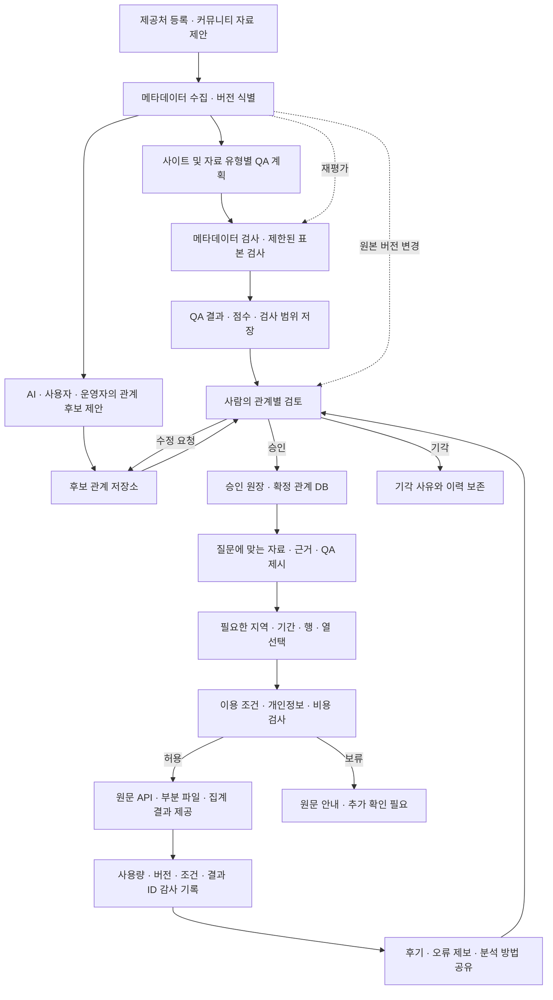

# v0.4 확충안 — 검토·QA·커뮤니티·필요한 데이터 제공

작성일: 2026-09-13. 상태: 팀 검토용 설계와 로컬 준비 도구. 실제 사람의 관계 승인, 원본 품질 평가, 커뮤니티 서비스, 대용량 전송은 아직 실행하지 않았다.

## 1. 제품의 중심

**“공공데이터를 함께 찾고 검증하며, 필요한 부분을 분석 가능한 형태로 이용하는 데이터 커뮤니티.”**

기존 온톨로지 탐색에 세 가지를 더한다. 사람이 관계와 분석 근거를 검토하는 과정, 자료별 QA와 버전 기록, 자료를 둘러싼 질문·오류 제보·분석 방법 공유다. 대용량 자료는 전체 다운로드에 앞서 필요한 범위를 줄여 제공한다.

‘데이터 디씨인사이드’라는 비유는 분야별 게시판과 자유로운 질문·토론 경험에 적용한다. 검증 배지와 품질 점수는 추천 수·인기도와 별도로 관리한다. 댓글의 주장이나 추천 수가 많다는 이유로 관계 DB가 자동 갱신되지 않는다.

데이터 공유·토론 서비스 자체가 없는 시장은 아니다. [Kaggle](https://www.kaggle.com/docs/datasets)은 데이터셋별 토론·코드·분석 경험을 제공하고, [data.world](https://docs.data.world/en/316242-collaborating-on-datasets.html)도 자료를 중심으로 협업한다. 우리 차별점은 **국내외 공공자료의 정의 차이와 결합 조건을 설명하고, 검토 이력과 QA를 축적해 분석 준비 시간을 줄이는 것**으로 검증한다.

## 2. 전체 과정

‘검증된 관계만 DB 반영’은 **검색에 사실로 사용하는 확정 영역**에 적용한다. 후보·기각·폐기된 관계도 별도 저장소에 남아야 중복 제안과 잘못된 재승인을 막을 수 있다. 기본 검색은 확정 영역을 사용하고, 실험 탐색에서 후보를 보일 때는 후보라고 표시한다.

QA는 관계 검토에 앞서 활용할 증거를 준비한다. QA가 높다고 관계가 참이 되는 것은 아니고, 관계가 타당하다고 모든 원자료의 품질이 높은 것도 아니다.

## 3. 관계 검토를 실제 업무로 만들기

현재 v0.3 `model.json`의 31개 관계는 `documented` 10개, `curated` 12개, `candidate` 9개다. 전부 AI가 만든 통계 가설은 아니다. 실제 LLM API도 호출하지 않았다. 공식 자료 설명에 근거한 연결, 편집한 정의, 사용자 요구사항에서 가져온 탐색 가설이 섞여 있다.

| 관계 종류 | 검토 방법 | 승인해도 주장할 수 없는 것 |
|---|---|---|
| 제공기관·원출처 | 공식 자료 ID·기관 설명·원문 버전 대조 | 포털이 언제나 원생산기관이라는 주장 |
| 개념·지표 정의 | 공식 용어·분모·단위·연령 정의 검토 | 칼럼 값까지 검증됐다는 주장 |
| 지표·데이터 대응 | 실제 계열·코드·기간·지역·대상 확인 | 같은 이름이면 자료가 동일하다는 주장 |
| 자료 결합 가능성 | 키 유일성, 1:1/1:N 관계, 단위·코드·기간 정합성, 매칭률 확인 | 결합된 두 변수 사이의 상관·인과 |
| 탐색 관련성 | 관련 자료를 함께 볼 근거와 적용 맥락 검토 | 통계적으로 상관이 확인됐다는 주장 |
| 통계적 연관성 | 원본 버전 고정, 분석 재현, 효과 크기·불확실성·민감도 검토 | 인과관계 또는 다른 지역·기간에도 동일하다는 주장 |

검토 상태는 `proposed → under_review → approved / needs_revision / rejected`로 이동한다. 승인 후 원본·정의·분석 조건 변경 시 `stale`로 전환하고 재검토한다. 승인 오류는 `revoked`, 새 버전으로 대체된 기록은 `superseded`로 남긴다. 승인자·시간·근거·적용 범위·제안 내용의 해시·원자료 버전을 기록한다.

수정 요청은 기존 제안 위에 덮어쓰지 않고 새 리비전을 만든다. 통계적 연관성은 분석 산출물을 먼저 고정한 후 승인한다. AI는 설명·분석 코드 초안을 도울 수 있지만 자기 제안에 승인자로 서지 못한다. 운영 서비스에서는 승인자의 계정·권한을 서버가 확인해야 하며, JSON의 `actor_type: human` 문자열만으로 사람임을 보장할 수 없다.

### 청년 유출과 고용을 검토한다면

예시 분석 질문은 ‘같은 지역·연령·기간에서 청년 순유출률과 청년 고용률이 연관되는가’다. 먼저 사용할 청년 연령과 지역 단위, 순유출의 부호, 분모와 시차를 정한다. 순유출률은 **(전출−전입) / 정의한 기준 청년 인구 × 1,000**처럼 측정 정의를 고정한다. 적절한 분모 자료가 없으면 이 지표를 계산하지 않는다.

국내 시군구 이동 통계와 World Bank의 국가별 고용률을 바로 결합하면 분석 단위가 맞지 않는다. 현재 6개 자료만으로 이 분석을 완료할 수 있다고 보지 않는다. 맞는 지역·연령별 고용 자료와 인구 분모부터 추가 확보한다.

분석 기록에는 사용한 변수·버전·관측 단위, 표본 수, 전처리, 결측 처리, 키 매칭률, 분석 코드·실행 환경, 계수·신뢰구간, 시차·계절성·공통 추세·공간 및 반복 관측 의존성 검토를 남긴다. 여러 가설을 탐색했다면 검정 횟수와 선택 과정을 기록한다. `p < 0.05` 또는 상관계수 한 개를 자동 승인 기준으로 쓰지 않는다. 음의 결과도 기록한다.

## 4. QA: 사이트별 검사 기준, 자료별 점수

평가 단위는 **데이터셋 × 버전 × 검사 범위 × QA 기준 버전**이다. ‘KOSIS는 8점’처럼 사이트 전체에 고정 점수를 매기지 않는다. 사이트별 어댑터로 서로 다른 필드와 누락 부호를 해석하되, 공통 네 축의 뜻과 기본 가중치는 맞춘다.

아래 가중치·산식은 팀이 검증할 **자체 초안**이며 포털의 공식 품질 인증이나 절대적인 정확도 점수가 아니다.

| 축 | 자체 점수 산식 · 기본 가중치 | 필요한 근거 |
|---|---|---|
| 신뢰도 | 출처 확인·방법론·정의와 단위·개정 이력의 4개 근거 충족률 × 10, 30% | 확인한 원문과 검토 기록. 실제 참값의 정확성을 보장하는 지표가 아님 |
| 커버리지 | 요청 범위에서 수록된 고유 관측 단위 수 / 기대 관측 단위 수 × 10, 25% | 지역×기간×대상 등의 기대 목록. 단순 파일 용량이나 행 수가 아님 |
| 최신성 | `10 × max(0, 1 − 지연 주기 수 / 3)`, 20% | 실제 최신 관측 기간, 공식 공표 예정일·주기·정상 발표 지연. 웹페이지 수정일로 대체하지 않음 |
| 완전성 | 검사 범위의 유효한 필수 값 수 / 수록된 관측 단위에 필요한 값 수 × 10, 25% | 칼럼·누락 부호·자료형·필수 조건별 검사 결과 |

커버리지는 **존재해야 할 관측 행이 수록됐는지**, 완전성은 **수록된 행에 필요한 값이 유효하게 채워졌는지**를 측정한다. 중복 행으로 분자를 늘리지 않는다. 0은 결측으로 취급하지 않는다. 해당 없음·비공개 처리·자료 미수집·API 실패를 구분하고 제외 기준도 기록한다.

기대 범위가 없거나 원본을 못 읽었으면 `null / 미평가`다. 미평가를 0점으로 벌주거나 10점으로 간주하지 않는다. 네 축이 모두 같은 범위에서 평가된 경우에만 종합 점수를 계산한다. 역사 자료·일회성 자료처럼 최신성이 적용되지 않는 경우는 `not_applicable`과 사유를 표시하고 이 초기 기준의 종합 점수는 산출하지 않는다. 기준을 바꾸면 QA 정책 버전도 바꾼다.

예를 들어 신뢰도 체크 4개 중 3개 충족으로 7.5점, 커버리지 7점, 최신성 9점, 완전성 8점이면 종합은 **7.80/10**이다. 이것은 산식 설명용 가상 숫자이며 실제 KOSIS·OECD 등의 평가 결과가 아니다. 화면에는 네 축, 검사 범위, 평가일·버전, 평가 완료 비율을 함께 표시한다. 표본 검사 점수를 전체 데이터 점수로 표시하지 않는다.

| 사이트 | 별도로 확인할 QA 항목 |
|---|---|
| KOSIS | 기관·통계표·분류·항목 코드, 연령·행정구역·단위, 수록 기간과 공표 주기, 자료 부호·개정, 표의 주석. 공식 API는 [통계목록](https://kosis.kr/openapi/devGuide/devGuide_0101List.do)과 [통계설명](https://kosis.kr/openapi/devGuide/devGuide_0401List.do)을 제공하므로 설명과 값의 검사를 분리한다. |
| 공공데이터포털 | 실제 제공기관, 파일/API/LINK 구분, 파일 버전·스키마, 총 행·페이지 누락, 인코딩·중복·키, 갱신 약속과 실제 관측 시점, 이용 조건. 실제 [파일 등록 예](https://www.data.go.kr/data/15159384/fileData.do)에는 전체 행·주기·한계·이용허락범위가 있으나, 이 메타정보만으로 원본 완전성을 확정하지 않는다. |
| OECD | SDMX dataflow·구조 버전·차원 순서·국가·연령·빈도·단위·계절조정·기준연도·관측 상태 부호와 개정. [API 문서](https://www.oecd.org/en/data/insights/data-explainers/2024/09/api.html)의 구조 조회와 데이터 조회를 함께 사용하고 자동 최신 구조로 바뀌는 영향을 검토한다. |
| World Bank | 지표·출처·원생산기관, 국가와 지역 집계의 구분, 국가별 실제 최신 연도, null·주석·모형 추정 여부, 페이지 수. [API 문서](https://datahelpdesk.worldbank.org/knowledgebase/articles/898581)의 MRNEV·gapfill은 빈 값을 과거 값으로 대체하거나 비어 있지 않은 값만 선택할 수 있으므로 품질 검사 시 원래 결측과 시점을 보존한다. |

이 초기 수치 QA는 표 형태의 관측 자료를 대상으로 한다. PDF 보고서·이미지·공간 래스터·텍스트 코퍼스 등은 별도 자료 유형 프로파일을 추가한다. 예를 들어 공간 자료는 좌표계·공간 범위·기하 유효성, 문서는 추출 성공률과 페이지 커버리지를 검사한다. 자료 유형과 검사 범위가 다른 점수를 하나의 순위로 섞지 않는다.

사이트별 요약이 필요하면 분야·자료 유형별로 평가 자료 수/전체 등록 수, 미평가 비율, 평가 기간, 점수 중앙값·분포를 보여준다. 일부 좋은 자료만 평가하고 포털 전체가 고품질이라고 표현하지 않는다. 이용자 별점과 공식 QA 점수는 분리한다.

### 점수로 상쇄할 수 없는 조건

라이선스·재제공 조건, 개인정보·기밀 여부, 파일 무결성, 심각한 스키마·키 오류는 별도 `pass / fail / unknown` 조건으로 둔다. QA가 9점이어도 재배포 권한이 불명확하면 파일 재제공을 승인하지 않는다. 이 프로젝트의 조건 검토 규칙은 법률 판단을 완료했다는 뜻이 아니다.

## 5. 500GB 다운로드 문제를 줄이는 과정

핵심 목표는 **분석에 쓸 첫 결과까지 걸리는 시간과 불필요한 전송량을 줄이는 것**이다. 전송 구간만 보면 `시간(초) = 실제 전송 바이트 × 8 / 실효 전송률(bps)`다. 500GB(십진 단위)를 100Mbps로 전송하면 이론상 약 11시간 7분, 1Gbps면 약 1시간 7분이다. 실제 전송에는 지연·재시도·압축 해제 등이 더해진다.

| 우선순위 | 제공 방식 | 가능 조건·한계 |
|---|---|---|
| 1 | 메타데이터·스키마·허용된 소량 미리보기 | 잘못된 자료 전체 다운로드를 예방. 미리보기에도 이용 조건과 개인정보 검토 필요 |
| 2 | 필요한 국가·지역·기간·지표만 원본 API로 조회 | 원본 API의 필터·호출 한도가 허용해야 함. 결과를 받는 양과 원본 서버의 내부 작업량은 다를 수 있음 |
| 3 | 필요한 열·파티션만 원격 조회 | Parquet 등 적합한 형식, 서버의 부분 요청 지원, 파일 통계·배치에 따라 효과가 달라짐 |
| 4 | 서버 또는 원본 가까이에서 집계한 작은 결과 | 집계 전에 많이 스캔할 수 있으므로 스캔량·CPU·메모리·비용을 별도로 제한 |
| 5 | 검토된 부분 파일 캐시·분할 다운로드·이어받기 | 재제공 허용, 버전·체크섬·보관 한도 필요. 첫 변환은 원본 전체 읽기가 필요할 수도 있음 |

[DuckDB 문서](https://duckdb.org/docs/lts/core_extensions/httpfs/https)는 원격 Parquet의 부분 읽기를 설명하지만 CSV는 대부분 전체 다운로드가 필요하다고 구분한다. [Parquet 필터 문서](https://duckdb.org/docs/stable/data/parquet/overview)도 파일 통계에 따라 건너뛰는 범위가 달라짐을 명시한다. 따라서 ‘500GB를 항상 몇 초 만에’처럼 약속하지 않는다. 단일 ZIP/CSV를 서버에 옮기는 것만으로 이 문제가 사라지지 않는다.

이어받기는 실제 `206` 응답과 범위를 확인하고 ETag·버전이 달라지면 기존 조각과 섞지 않는다. [HTTP Range 문서](https://developer.mozilla.org/en-US/docs/Web/HTTP/Guides/Range_requests)처럼 서버가 전체 응답을 돌려주는 경우도 처리해야 한다.

500GB 중 필요한 결과가 실제로 500MB라면 사용자 수신량은 99.9% 줄어든다. 이는 **가상 예시**이며 우리 서비스의 측정 성과가 아니다. 원본 쪽에서 500GB를 모두 읽었다면 원본 수신·스캔 비용은 그대로일 수 있다. `원본에서 읽은 바이트`, `서버가 스캔한 바이트`, `사용자에게 보낸 바이트`, `총 대기 시간`을 따로 기록한다.

### 작은 서버와 양립시키기

웹·관계 DB와 대용량 작업자를 분리한다. 월 10만원 목표의 기본 서비스는 메타데이터·관계·작은 QA 요약을 관리하고, 대용량 작업은 별도 대기열에서 사전 예산이 있는 작업만 허용한다. 원본 직접 다운로드가 가능하면 사용자가 원본에서 받도록 안내한다.

현재 요청별 임시 디스크 200MB·전체 400MB 정책으로 500GB를 받거나 변환하지 않는다. 이를 처리하려면 명시적인 별도 작업 프로파일과 저장소·스캔·전송 예산이 필요하다. 조건을 만족하지 않으면 작업을 보류하고 가능한 원문/부분 조회 방법을 반환한다. RAM뿐 아니라 DB 스캔·임시 디스크·원본 수신·외부 송신·캐시도 관리한다. [S3 과금 항목](https://docs.aws.amazon.com/AmazonS3/latest/userguide/aws-billing-reports.html)은 저장·요청·전송 비용이 별개임을 보여준다.

## 6. 커뮤니티를 DB의 근거로 연결하기

분야 게시판과 **자료별 페이지**를 함께 둔다. 자료 페이지는 ‘개요·QA·변수 사전·관계·토론·버전·제공 방법’으로 구성한다. 토론은 질문, 오류 제보, 관계 제안, 분석 방법, 활용 사례로 분류하고 각 글을 자료 ID·버전·지표·관계 후보 ID에 연결한다.

예: 사용자가 ‘2024년 특정 지역 값이 빠졌다’고 제보 → 같은 버전으로 재현 → QA 이슈 등록 → 평가 보류/재평가 → 수정 버전 기록 → 영향받는 관계와 저장된 조회 조건을 재검토한다. 확인되지 않은 제보는 공식 오류 확정과 구분한다.

초기에는 파일 무제한 업로드보다 **원문 링크·정제 방법·재현 코드·검토된 소량 예시** 공유를 지원한다. 업로드 자료는 격리·형식/악성 파일 검사·제공 권리·개인정보 검토 후 제공한다. 신고·중복 자료·스팸·이해관계 표시와 이의 제기 경로도 둔다. 커뮤니티 기여도는 근거가 채택되거나 오류가 재현된 활동을 중심으로 산정하고, 좋아요를 QA 값에 더하지 않는다.

## 7. 저장할 개체와 갱신 규칙

| 개체 | 핵심 필드 |
|---|---|
| DatasetVersion | 자료 ID, 원문 ID, 버전·시점·체크섬, 스키마, 관측 범위, 이용 조건 참조 |
| RelationProposal | 양쪽 개체·관계 종류, 제안자 종류, 제안 리비전·해시, 근거, 상태 |
| RelationReview | 검토자·권한, 판정·사유, 제안 해시, 원자료 버전, 검증 방법, 적용 범위, 시각 |
| AnalysisRun | 질문·변수·단위, 입력 버전, 코드 해시·환경, 전처리, 표본 수, 결과·불확실성·한계 |
| QAAssessment | 자료 버전, 사이트·자료 유형, 규칙 버전, 표본/전수 범위, 분자·분모, 점수·미평가 사유, 검사 증거 |
| Discussion / DataIssue | 자료·버전·관계 ID, 글 유형, 제보·재현·해결 상태, 검토 기록 참조 |
| DeliveryPlan / DeliveryRun | 원문/부분 조회/집계/캐시 방식, 범위·열, 권한 판정, 예상·실측 바이트와 비용, 결과 버전·TTL |
| AuditEvent | 행위자 ID, 대상·버전, 이전/이후 상태, 판정 근거 ID, 정책 버전, 사용량·시각 |

검토 원장이 승인 사실의 기준이고 `model.json`은 승인 결과를 반영하는 **생성 산출물**로 둔다. AI가 최종 파일을 직접 덮어쓰지 않는다. 검토 이력·원자료 버전·QA 정책·공개 상태가 바뀌면 영향받는 결과를 재생성한다. 기각 기록과 과거 분석을 삭제하지 않는다. 운영 감사는 최소 ID 중심으로 기록하고 공개 커뮤니티 글과 비공개 사용자 질문을 구분한다.

v0.3의 `documented`는 공식 설명을 관찰했다는 뜻이다. 새 승인 원장의 ‘사람이 검토·승인했다’는 기록으로 자동 승격하지 않는다. 초기 승인 원장은 비어 있으며, 기존 31개 관계는 근거 상태를 유지한 채 새 검토 대기열로 가져온다. 기존 화면은 v0.3 후보 탐색 데모로 유지한다.

## 8. 우리 팀이 지금 할 순서

| 단계 | 산출물 | 완료 조건 |
|---|---|---|
| A. 기준 합의 | 관계 검토 규칙·4개 사이트 QA 프로파일·양식 | 두 검토자가 같은 소량 사례를 평가하고 판정 차이와 애매한 규칙을 정리 |
| B. 실제 소량 평가 | 버전이 고정된 자료 8~12개 평가 제안 | 원본 범위·검사 방식·결측 사유·단위·점수 근거가 재현됨. 자료 개수는 초기 작업 묶음이지 서비스 범위 제한이 아님 |
| C. 관계 검토 1회전 | 기존 31개 관계의 승인/보류/수정/기각 기록 | 공식 정의 연결부터 처리하고, 실증 분석이 필요한 가설은 별도 검토 |
| D. 자료 중심 커뮤니티 | 자료 페이지·질문·오류 제보·분석 방법 | 제보 한 건이 재현·QA 갱신·관계 재검토까지 연결됨 |
| E. 부분 제공 검증 | 원본 API 1개 또는 적합한 파일 1개의 부분 조회 | 동일 질문·범위에서 전체 다운로드 대비 총 시간·읽은 양·송신량·비용을 측정 |
| F. 운영 연결 | 승인 권한·DB 트랜잭션·감사·제한된 LLM | 후보가 확정 검색에 섞이지 않고 예산 초과·검토 만료가 실제로 차단됨 |

성공 지표는 총 저장 용량·등록 포털 수만으로 잡지 않는다. **자료를 찾은 뒤 분석 가능한 첫 결과까지 걸린 시간**, 근거를 제시한 추천 비율, 버전이 유효한 검토 관계 비율, QA 평가 범위, 오류 제보 해결 시간, 요청당 전송량·비용과 재사용률을 측정한다. 비교 전에는 ‘더 빠르다’ 또는 ‘더 믿을 만하다’를 성과로 확정하지 않는다.

## 9. 이번에 준비한 것

[governance 폴더](../ontology-prototype/governance/README.md)에 사이트별 QA 규칙, 관계 검토 상태·요건, 기록 양식, 기존 모델에서 검토 대기열을 만드는 도구를 추가했다. 기존 6개 자료의 QA는 원본 미검사로 미평가이며 점수를 만들어 넣지 않는다. 운영 승인·실제 점수 측정·커뮤니티·대용량 제공 기능은 위 단계에서 구현할 대상이다.
