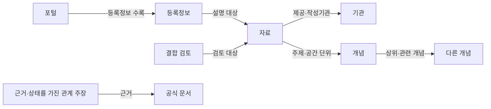

# 공공데이터 온톨로지 프로토타입 v0.1.0

최신 설계와 질문 중심 그래프는 [Discovery Platform v0.3](discovery-platform/README.md)에 있다.

전국·전 분야로 확장한 현재 작업은 [제공처 조사·공통 온톨로지 v0.2](national-catalog/README.md)에서 확인한다. 아래 모델은 기존 시연용 사례다.

검토 기준일: 2026-09-10. 범위: 포털 3곳 / 자료 6개 / 등록정보 7개 / 개념 11개.

사용자 질문에 필요한 자료를 찾고, 출처·측정 의미·결합 조건을 설명하기 위한 지식 구조다. 자연어 LLM, 실데이터 조회·결합, 거래 기능은 이번 산출물에 포함되지 않는다.

## 읽는 순서

1. 이 설명서에서 범위와 주의할 관계를 확인한다.
2. `model.json`의 데이터 목록·개념·관계·매핑·질문을 수정한다.
3. `ontology.ttl`은 RDF 도구로, `graph.json`은 일반 앱에서 읽는다.
4. `validation-report.json`은 구조·질의 검증 결과이며 실제 데이터 품질 인증이 아니다.

## 구조



포털은 `dcat:Catalog`, 등록정보는 `dcat:CatalogRecord`, 자료는 `dcat:Dataset`, 파일 제공 형식은 `dcat:Distribution`, 개념은 `skos:Concept`에 맞춰 표현했다. 완전한 외부 인증 프로파일이 아니라 DCAT·SKOS를 활용한 로컬 설계다. namespace의 example.org는 발급 전 임시 식별자이며 실제 서비스 주소가 아니다.

근거 표준: [S11](https://www.w3.org/TR/vocab-dcat-3/), [S12](https://www.w3.org/TR/skos-primer/).

## 포털과 기관

| 포털 | 역할 | 운영기관 |
|---|---|---|
| [공공데이터포털](https://www.data.go.kr/) | 다기관 데이터 등록·발견 경로 | 이번 범위에서 미확정 |
| [서울 열린데이터광장](https://data.seoul.go.kr/) | 서울 자료 상세·파일·API 안내 | 서울특별시 |
| [KOSIS 국가통계포털](https://kosis.kr/) | 통계표 조회·제공 경로 | 국가데이터처 |

포털 간 직접 안내 관계는 특정 등록정보의 근거를 갖는 관계다. 포털 전체가 동기화되거나 모든 데이터가 중복 수록된다는 뜻은 아니다. KOSIS와 서울 포털은 이번 모델에서 인구 분석에 함께 활용할 수 있는 자료의 제공처이며 시스템 간 연동을 확인한 것은 아니다.

## 자료 목록

| 자료 | 식별자 | 시간·공간 단위 | 상태 | 근거 |
|---|---|---|---|---|
| [서울시 버스노선별 정류장별 승하차 인원 정보](https://data.seoul.go.kr/dataList/OA-12912/S/1/datasetView.do) | OA-12912 | 일 / 노선 × 정류장 | 공식 목록·설명 확인 | [S1](https://www.data.go.kr/catalog/15051734/fileData.json), [S2](https://data.seoul.go.kr/dataList/OA-12912/S/1/datasetView.do) |
| [서울시 버스노선별 정류장별 시간대별 승하차 인원 정보](https://data.seoul.go.kr/dataList/OA-12913/F/1/datasetView.do) | OA-12913 | 월 × 시간대 / 노선 × 정류장 | 공식 목록·설명 확인 | [S3](https://data.seoul.go.kr/dataList/OA-12913/F/1/datasetView.do) |
| [서울시 지하철호선별 역별 승하차 인원 정보](https://data.seoul.go.kr/dataList/OA-12914/S/1/datasetView.do) | OA-12914 | 일 / 호선 × 역 | 공식 목록·설명 확인 | [S4](https://data.seoul.go.kr/dataList/OA-12914/S/1/datasetView.do) |
| [행정동 단위 서울 생활인구(내국인)](https://data.seoul.go.kr/dataList/catalogView.do?currentPageNo=1&infId=OA-14991&searchKey=null&searchValue=&srvType=S) | OA-14991 | 시각별 추계 · 원본 재확인 필요 / 행정동 | 생산 종료 안내 | [S5](https://data.seoul.go.kr/dataList/catalogView.do?currentPageNo=1&infId=OA-14991&searchKey=null&searchValue=&srvType=S), [S6](https://data.seoul.go.kr/dataVisual/seoul/seoulLivingPopulation.do) |
| [[내국인] 행정동별 서울 생활인구(250m)](https://data.seoul.go.kr/dataList/OA-23016/S/1/datasetView.do) | OA-23016 | 특정 시점 · 시각 필드는 원본 확인 필요 / 행정동; 원천은 250m 격자 | 공식 목록·설명 확인 | [S6](https://data.seoul.go.kr/dataVisual/seoul/seoulLivingPopulation.do), [S7](https://data.seoul.go.kr/dataList/OA-23016/S/1/datasetView.do) |
| [행정구역(시군구)별, 성별 인구수](https://kosis.kr/statHtml/statHtml.do?orgId=101&tblId=DT_1B040A3) | DT_1B040A3 | 월 / 행정구역(시군구) × 성별 | 공식 목록·설명 확인 | [S8](https://kosis.kr/serviceInfo/newContrainDataDetail.do?boardIdx=2008001&boardOrgId=101), [S9](https://kosis.kr/civilComplaint/qnaDetail.do?boardIdx=24377) |

자료별 상세 제한과 미확인 항목은 model.json의 caveats, missing에 보존했다. 자료에 접근 가능한 설명 페이지와 API 동작 여부는 별개다. 페이지 갱신일, 실제 관측 시점, 파일 게시일을 동일하게 취급하지 않는다.

## 개념 사전

아래 정의와 분류는 출처를 참고한 프로토타입의 편집 판단(curated)이다. 특정 기관이 이 온톨로지를 공식 승인했다는 뜻이 아니다.

| 개념 | 정의 |
|---|---|
| 대중교통 이용 | 버스·지하철 등 대중교통의 이용 현상을 탐색하는 주제. |
| 버스 이용량 | 버스 승차·하차 기록을 기준으로 집계하는 이용량. 서로 다른 승차를 한 사람으로 중복 제거한 인구와 구분. |
| 지하철 이용량 | 호선·역별 승차·하차 기록에 기반한 이용량. 노선 포함 범위를 확인해야 함. |
| 인구 현황 | 기준 장소·시점·대상·측정 방식에 따라 구분하는 인구 지표의 상위 개념. |
| 생활인구 | 특정 장소·시점에 존재하는 인구의 추계. 이번 자료는 내국인 범위. 여러 시각 값을 더해 순방문자 수로 해석할 수 없음. |
| 주민등록인구 | 주민등록 기준의 인구 지표. 특정 시각에 그 장소에 존재하는 인구와 구분. |
| 유동인구라는 검색 의도 | 이동·방문·체류 인구를 찾는 사용자 표현. 생활인구와 자동 동의어 처리하지 않고 측정 목적을 확인. |
| 버스정류장 | 버스가 정차하는 시설. 표준 정류장 ID와 ARS 번호의 코드 체계는 따로 확인. |
| 지하철역 | 지하철 이용량의 공간 기준. 동일 역명·환승역·호선별 행을 구분할 키가 필요. |
| 행정동 | 행정 업무 기준의 공간 구역. 기준일에 따른 코드·경계 버전을 보존하며 법정동과 구분. |
| 시군구 | KOSIS 주민등록인구 표의 지역 분류 수준. 상위 합계와 하위 구역을 중복 합산하지 않음. |

## 관계 상태

- documented: 공식 자료에서 해당 사실을 확인했다. 원본 행 검증과 구별한다.
- curated: 공식 자료를 근거로 이번 프로토타입에서 정의한 분류·분석 관계다.
- candidate: 추가 확인이 필요한 관계다. RDF에서 직접 사실 트리플로 내보내지 않고 상태를 가진 Claim으로만 저장한다.

`relatedConcept`는 주제 연관, `analyticalComplement`는 분석에 함께 참고할 관계다. 둘 다 조인 가능성·동일성·인과관계를 뜻하지 않는다. 조인 가능 여부는 별도의 JoinAssessment로 관리한다. 이 버전에는 검증 완료된 조인이 없다.

## 확인 과정에서 발견한 사례

1. 공공데이터포털의 버스 등록정보에는 일별 갱신 설명과 수시 갱신 표기가 함께 있다. 어느 하나로 덮어쓰지 않고 등록정보별로 보존했다.
2. 15051734 → OA-12912의 정확한 대응은 검색 색인에서 확인했지만 현재 상세페이지 직접 열기에 실패했다. 따라서 확정 동일성 관계를 만들지 않았다.
3. OA-14991은 2026-07-31 이후 기존 자료 생산 종료를 명시한다. 최신 자료 추천에서는 제외하며 실제 마지막 관측일을 임의로 기입하지 않았다.
4. OA-23016은 250m 격자에서 행정동으로 집계한 자료다. 파일명이 바뀐 동일 자료라고 단정하지 않고 후속 자료 후보로 연결했다.
5. 월별 파일 배포와 월별 관측은 다르다. 일별 버스·지하철 자료가 월 파일로 제공되어도 관측 단위는 일이다.
6. 페이지에 공통으로 들어 있는 숨겨진 ‘서비스 종료’ 팝업 문구는 종료 판정의 근거로 쓰지 않았다. OA-14991의 구체적 전환 안내만 사용했다.

## 연결 조건

### 버스 · 일별 승하차 ↔ 버스 · 월별 시간대 집계

목적: 일별 자료를 월 합계로 집계한 뒤 시간대 자료와 대조. 상태: `requires_validation`.

- 일별 자료를 월 단위로 먼저 집계
- 양쪽 키 체계·기간·포함 범위를 검증
- 월별 시간대 자료의 합계 정의를 확인
- 미해결: 현재 원본 컬럼 및 중복 키 검증 전

### 버스 · 일별 승하차 ↔ 생활인구 · 250m 기반 행정동 집계

목적: 지역별 버스 이용과 생활인구의 관계 탐색. 상태: `requires_validation`.

- 버스정류장 좌표와 행정동 경계 자료를 추가 확보
- 생활인구의 일 대표값 산출 기준을 정함
- 측정 범위·국적 범위 차이를 표시
- 미해결: 공간 대응표 없음
- 미해결: 관측 단위 확인 전
- 미해결: 인과관계를 결론 낼 수 없음

### 지하철 · 일별 승하차 ↔ 생활인구 · 250m 기반 행정동 집계

목적: 역 주변 대중교통 이용과 생활인구 비교. 상태: `requires_validation`.

- 주변 반경 또는 행정동 중 분석 공간을 먼저 정의
- 역 위치와 시점별 경계 자료를 추가 확보
- 일별 지하철 자료의 시간대 제약을 반영
- 미해결: 역 위치·공간 대응표 없음
- 미해결: 일별 자료로 출근시간을 직접 조회할 수 없음

### 생활인구 · 250m 기반 행정동 집계 ↔ 주민등록인구 · 시군구·성별

목적: 지역의 존재 인구와 등록 인구를 구별해 비교. 상태: `requires_validation`.

- 같은 기준일의 구역·코드 체계로 정렬
- 생활인구 대표 시각 또는 기간 평균을 명시
- 국적·대상 범위 확인; 양쪽 값을 합산하지 않음
- 미해결: KOSIS 지역 코드 원본 확인 전
- 미해결: 성별·대상 범위 비교 전
- 미해결: 이용 조건 확인 필요

### 생활인구 · 기존 방식 / 생산 종료 ↔ 생활인구 · 250m 기반 행정동 집계

목적: 장기 생활인구 추세 분석. 상태: `blocked_for_blind_append`.

- 겹치는 기간의 추계 방법·수치 차이를 검증
- 방법 변경 시점을 결과에 표시
- 미해결: 동일한 시계열이라는 근거 없음
- 미해결: 같은 컬럼명만으로 이어 붙일 수 없음

## 필드 매핑

실제 확인한 메타데이터 필드와 아직 확인하지 못한 원본 데이터 필드를 분리했다. `source_path: null`인 필드는 정규화 목표만 정한 상태이므로 실제 API 필드처럼 사용하면 안 된다. 현재 데이터셋 원본의 컬럼·자료형·키 유일성·결측률은 모두 미검증이다.

| 대상 | 원문 경로 | 정규화 목표 | 상태 |
|---|---|---|---|
| record-go-bus | name | dcterms:title | documented |
| record-go-bus | creator.name | 프로토타입 제공기관 후보 | curated |
| record-go-bus | dateModified | 등록정보 수정일 | documented |
| record-go-bus | license | 원문 이용 조건 표시 | documented |
| ds-bus-daily | 미확인 | 정규화 필드 stop_identifier | candidate |
| ds-living-new | 미확인 | 정규화 필드 administrative_area_code | candidate |

## 대표 질문과 기대 결과

이 질문들은 온톨로지의 범위를 확인하는 사례다. 자연어 질의 엔진을 구현했다는 뜻은 아니다.

- **Q1 · 서울 버스와 지하철 이용량 자료를 찾아줘** — 대중교통 이용의 하위 개념을 따라 세 자료 발견. 원문 제공처는 서울 포털. 일별·월별 시간대 집계를 구분.
- **Q2 · 공공데이터포털과 서울 포털은 어떻게 연결돼?** — 15051734 등록정보의 서울 포털 안내는 공식 메타데이터로 확인. 정확한 OA-12912 대응은 색인 근거의 후보로 유지.
- **Q3 · 최신 행정동 생활인구 자료를 찾아줘** — 현행 안내의 OA-23016을 제시. 생산 종료된 OA-14991은 최신 후보에서 제외. API 최신 관측일은 아직 확인하지 않음.
- **Q4 · 생활인구와 주민등록인구를 합쳐 전체 인구를 구해줘** — 두 개념이 다르므로 합산하지 않음. 같은 공간·기간으로 맞춘 비교를 위한 조건만 제안.
- **Q5 · 출근시간 지하철 이용량과 생활인구를 비교해줘** — 등록된 지하철 자료는 일별이므로 요청을 직접 충족하지 못함. 시간대 자료와 역 공간 대응표를 추가 확보해야 함.
- **Q6 · KOSIS 인구 자료는 누가 만드는 자료야?** — 통계 작성기관은 행정안전부. KOSIS 운영기관인 국가데이터처와 역할을 구분.

## 개발자가 이어서 할 일

1. 원본 파일 또는 적법하게 발급한 API 접근으로 컬럼·키·관측 기간을 확인한다.
2. 버스정류장·역 좌표, 기준일별 행정동 경계와 코드 대응표를 추가 등록한다.
3. 후보 매핑·조인마다 파일 버전, 표본 수, 실패·누락 비율, 검토자를 기록한다.
4. 생활인구 구·신 방식 비교를 완료하기 전에는 장기 시계열을 자동 접속하지 않는다.
5. 추천 화면의 허용과 원본 파일 재배포·거래의 허용을 별도 정책으로 구현한다.

## 재생성 및 검증

Python 3와 rdflib 7.6.0을 사용했다. `python -m pip install -r ontology-prototype/requirements.txt`로 설치한다. 초기 버전 그래프 재생성 결과는 프로젝트 내부 `.local/legacy-visualizations/`에 저장된다. 최신 공유 그래프는 [저장소 안내](../README.md)를 따른다.

```powershell
python ontology-prototype/build.py
python ontology-prototype/validate.py
```

model.json이 편집 원본이며 ontology.ttl, graph.json, README.md는 build.py가 생성한다. 시각 탐색용 fragment는 model.json만 포함하며 네트워크·LLM 호출을 하지 않는다.

## 근거 목록

- **S1** [공공데이터포털 버스 일별 자료 메타데이터](https://www.data.go.kr/catalog/15051734/fileData.json) · `official_metadata` — 서울특별시 제공, 일별 집계, 서울 포털로 이동하는 등록정보. 등록정보의 수시 표기와 본문의 일별 갱신 설명을 별도로 보존.
- **S2** [서울 버스 일별 승하차 자료](https://data.seoul.go.kr/dataList/OA-12912/S/1/datasetView.do) · `official_page` — 노선·정류장별 일 단위 이용량. 과거 자료는 월별 파일로 제공. 파일 배포 주기와 관측 단위를 구분.
- **S3** [서울 버스 시간대별 승하차 자료](https://data.seoul.go.kr/dataList/OA-12913/F/1/datasetView.do) · `official_page` — 월 단위의 노선·정류장·시간대별 자료. 현금 이용은 제외된다고 FAQ에 안내. 정확한 컬럼·집계 방식은 원본 확인 필요.
- **S4** [서울 지하철 일별 승하차 자료](https://data.seoul.go.kr/dataList/OA-12914/S/1/datasetView.do) · `official_page` — 호선·역별 일 단위 교통카드 이용량. 신분당선은 제공하지 않는다고 FAQ에 안내.
- **S5** [기존 행정동 생활인구 종료 안내](https://data.seoul.go.kr/dataList/catalogView.do?currentPageNo=1&infId=OA-14991&searchKey=null&searchValue=&srvType=S) · `official_catalog_record` — 250m 격자 방식 전환에 따라 2026년 7월 31일 이후 기존 자료 생산 종료를 명시. 메타데이터에 표시된 종료를 근거로 사용.
- **S6** [서울 생활인구 정의와 현행 자료 안내](https://data.seoul.go.kr/dataVisual/seoul/seoulLivingPopulation.do) · `official_guide` — 특정 지역·시점의 존재 인구를 추계하는 통계. 현행 행정동 내국인 자료 링크가 OA-23016으로 연결됨. 주민등록인구와 의미가 다름.
- **S7** [250m 기반 행정동 생활인구 자료](https://data.seoul.go.kr/dataList/OA-23016/S/1/datasetView.do) · `official_page` — 250m 격자 자료를 행정동으로 집계한 내국인 생활인구. 출력 공간 단위는 행정동이며 원천 격자와 구분. 페이지 갱신일 2026-09-10.
- **S8** [KOSIS 주민등록인구 최근수록자료](https://kosis.kr/serviceInfo/newContrainDataDetail.do?boardIdx=2008001&boardOrgId=101) · `official_catalog` — 행정구역(시군구)별 성별 인구수, 행정안전부, 월 주기 확인. 표시된 최근 수록 시점은 실제 API 최신값 검증으로 취급하지 않음.
- **S9** [KOSIS 주민등록인구 공개 경로 답변](https://kosis.kr/civilComplaint/qnaDetail.do?boardIdx=24377) · `official_answer` — 행정안전부 공개 후 가공·점검하여 KOSIS에 반영. DT_1B040A3 통계표 주소 확인. 질문자 정보는 수집하지 않음.
- **S10** [공공데이터포털 버스 일별 등록 상세](https://www.data.go.kr/data/15051734/fileData.do) · `search_index_only` — 검색 색인에서 OA-12912 직접 연결 URL 확인. 상세페이지 직접 열기는 실패. 포털 간 정확한 목적지 연결은 후보 상태로 보존.
- **S11** [W3C DCAT 3](https://www.w3.org/TR/vocab-dcat-3/) · `official_standard` — Catalog, CatalogRecord, Dataset, Distribution 구분의 근거.
- **S12** [W3C SKOS Primer](https://www.w3.org/TR/skos-primer/) · `official_standard` — 개념, 정의, 상위·관련 관계의 표현을 참고. 관련 관계를 동일성이나 조인 가능성으로 해석하지 않음.
