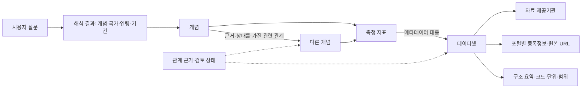
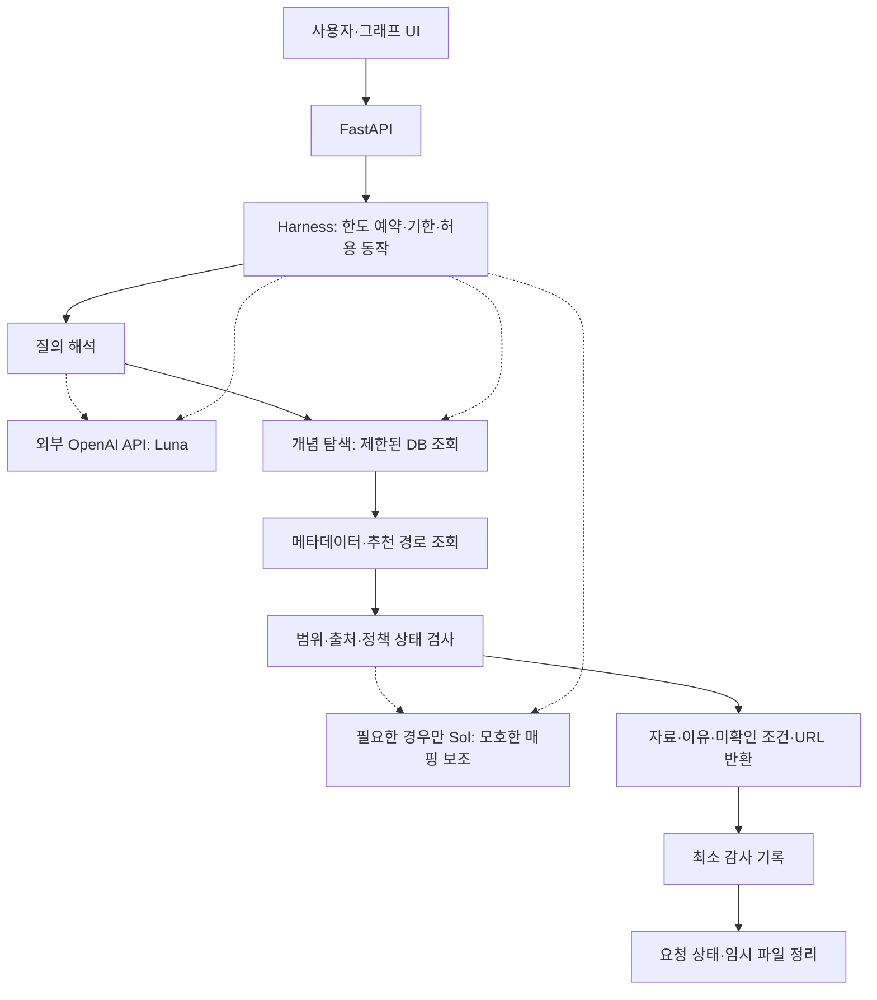

# v0.3 재구성 설계

후속 검토·QA·커뮤니티·대용량 제공 과정은 [v0.4 확충안](../../docs/process-v0.4.md)에 정의했다. 이 문서는 v0.3 구현과 설계를 설명하며, 기존 근거 상태는 새 사람 승인 기록과 구분한다.

목표는 국내외 공공데이터의 의미와 관계를 관리하고, 사용자가 어떤 경로로 자료를 찾았는지 설명하는 Discovery Platform이다. 원본 대용량 자료의 상시 보관 없이 메타데이터·관계·원본 URL·자료 API 안내를 관리한다.

## 1. 질문에서 자료로 이어지는 구조

포털과 제공기관은 별도 개체다. KOSIS는 제공 경로이고 자료 제공기관은 공식 목록의 기관 표기를 따른다. World Bank가 제공하는 WDI 노동지표도 메타데이터의 원출처 ILO를 별도 보존한다. OECD와 World Bank의 비슷한 지표를 같은 자료로 자동 합치지 않는다.

기존 v0.2의 Catalog·CatalogRecord·Dataset·Distribution·Schema·Field·Concept·SourceEvidence 구조를 계속 사용한다. v0.3에서는 질문 주제, 측정 지표, 추천 경로, 자원 정책, 예산 실행을 추가했다. 이번 RDF는 질문 예시의 관계를 표현한 별도 교환 파일이며 기존 전국 조사 RDF를 대체해 삭제하지 않는다.

## 2. 관계가 뜻하는 것

| 관계 | 허용하는 해석 | 허용하지 않는 해석 |
|---|---|---|
| 질문 → 개념 | 질의를 해당 개념으로 해석한 기록 | 질문의 모든 조건이 명확해짐 |
| 인구이동 → 고용·주거·교육 | 첨부 문서에서 제안한 탐색 가설 | 고용·집값 등이 인구 유출을 일으킨다는 인과 확정 |
| 개념 → 지표 | 측정할 대상을 구체화한 편집 정의 | 특정 포털의 컬럼 코드까지 자동 확인 |
| 지표 → 데이터셋 | 자료 설명에 근거한 대응 또는 대응 후보 | 필요한 연령·국가·기간의 하위계열이 이미 검증됨 |
| 자료 → 제공기관 | 출처가 명시한 자료 제공 경로 | 제공기관과 원생산기관이 언제나 같음 |
| 자료 ↔ 자료 | 원본 ID·버전·단위·키를 검토한 대응 | 제목 유사성이나 같은 연령 키워드만으로 동일성 선언 |

관계 레코드에는 주어·관계·목적어, 근거 ID, `documented / curated / candidate` 상태, 탐색 역할, 확인일·버전, 유효 범위를 둔다. 예시 모델의 확인일은 출처 기록에 연결했다. `candidate`는 RDF의 관계 주장으로만 기록하고 확정 관계로 출력하지 않는다. 편집한 관계도 확인된 외부 사실과 구별한다.

통계적 분석은 별도 AnalysisResult로 저장한다. 분석 질문, 입력 버전, 관측 단위, 전처리, 방법, 표본수, 계수·불확실성·한계가 필요하다. 온톨로지의 모든 관계를 모든 컬럼 쌍의 상관계수로 만드는 접근은 사용하지 않는다.

## 3. 예시 자료의 검증 수준

| 자료 | 확인한 근거 | 남은 확인 |
|---|---|---|
| KOSIS 이동자수·순이동자수 | [공식 최근수록자료](https://kosis.kr/serviceInfo/newContrainDataDetail.do?boardIdx=1976003&boardOrgId=101)의 제목·통계표 ID·월 주기 | 표 직접 접근, 연령·지역 코드, 전체 기간·단위 |
| World Bank 청년 실업률 | [지표 설명](https://data.worldbank.org/indicator/SL.UEM.1524.ZS)과 [메타데이터 API](https://api.worldbank.org/v2/indicator/SL.UEM.1524.ZS?format=json) | 국가별 관측값·기간·빈도·결합 조건 |
| World Bank 청년 고용률 | [메타데이터 API](https://api.worldbank.org/v2/indicator/SL.EMP.1524.SP.ZS?format=json) | 원본 관측값 응답 구조와 국가별 범위 |
| OECD 실업 통계 | [청년 실업률 설명과 원본 안내](https://www.oecd.org/en/data/indicators/youth-unemployment-rate.html) | 기본 링크의 15세 이상 조건을 청년 15~24세 조건으로 바꾸고 검증 |
| OECD 주택가격 | [지표 정의·원본 안내](https://www.oecd.org/en/data/indicators/housing-prices.html) | 가격·임대료 계열, 기준연도·기간·국가별 단위 |

국내 시군구 이동 통계와 국가 단위 국제 지표를 같은 표에 바로 결합하지 않는다. 실업률은 해당 노동력 대비 비율이며 고용률은 해당 인구 대비 비율이다. 주거비 지수는 개별 계약의 원화 월세 금액과 다르다. 이 구분은 자료 선택 이유와 결합 보류 조건에 포함된다.

[OECD NEET 설명](https://www.oecd.org/en/data/indicators/youth-not-in-employment-education-or-training-neet.html)은 확인했으나 안내된 기본 화면과 청년 하위계열의 대응을 확정하지 않았다. NEET는 졸업 후 지역 이동과도 다른 지표이므로 둘을 자동 대체하지 않았다.

## 4. LLM과 Harness가 실행되는 위치

문서의 LLM을 마지막 단계에만 놓는 단일 직렬 흐름을 보완했다. 질의 해석에 LLM이 필요하면 탐색 전에 호출하고, DB 검색·검증은 서버 코드가 수행한다. 확인된 ID·설명·출처의 작은 묶음만 LLM에 전달한다. 자유로운 임의 도구 실행이나 원본 전체 데이터 전달을 기본으로 하지 않는다.

OpenAI Docs의 [모델 목록](https://developers.openai.com/api/docs/models)에서 `gpt-5.6-luna`, `gpt-5.6-sol`을 확인해 설정에 반영했다. 문서의 Luna/Sol은 이 모델 ID에 대응시켰다. 이 계정의 API 접근 여부와 실제 호출은 미검증이다. 두 호출 한도에는 재시도·승격 호출도 포함하고, 이미 두 번 호출했다면 추가 승격을 허용하지 않는다. Sol이 이용 조건을 승인하거나 후보 관계를 자동 확정하지 않는다.

세션 정리와 외부 사업자 보관 정책을 구별한다. 서비스의 요청 상태는 정리하고 API 요청은 `store:false`를 사용하는 설계다. 이것만으로 외부 사업자의 모든 보관이 사라진다고 표현하지 않는다. 상세 적용은 [OpenAI 데이터 제어 문서](https://developers.openai.com/api/docs/guides/your-data)에 따라 계정 설정·사용 기능별로 확인한다.

## 5. 깊이 2의 의미와 예산 적용

**개념 탐색 깊이**는 질문 → 최초 개념과 개념 → 다른 개념의 이동 횟수다. 개념 → 지표 → 자료 → 제공기관은 메타데이터 조회 단계이며, 별도로 최대 3단계만 따라간다. 두 종류의 단계 모두 노드·관계·자료 수·시간 제한을 소비한다.

따라서 깊이 2에서 질문 → 인구이동 → 고용까지 의미를 확장하고, 고용의 지표·자료·제공기관을 제한된 수만 조회할 수 있다. 제한 없는 구조 탐색을 의미하지 않는다.

| 예산 | 기본값 | 적용 방식 |
|---|---|---|
| Agent | 4턴·LLM 2회·도구 8회·재시도 1회 | 모든 실제 시도 전에 잔여량 예약; 실패도 사용량 집계 |
| 그래프 | 개념 깊이 2·노드 30·관계 40·자료 10 | 추가 노드·관계를 읽거나 결과에 넣기 전에 검사 |
| 그래프 작업량 | 관계 검사 200개·조회 1초 | 결과 개수만 작고 내부 전량 탐색은 커지는 상황 제한 |
| 요청 | 전체 30초·개별 호출 10초 | 남은 전체 기한보다 긴 개별 타임아웃 금지 |
| Context | 최근 3턴·6,000토큰 | 턴 수와 토큰 수를 함께 제한; 요약 호출도 LLM 예산 소비 |
| 동시성 | 실행 2개·대기 8개 | 요청별 상한 외 서버 전체 사용량 제어 |
| 임시 디스크 | 요청당 200MB·전체 400MB·TTL 300초 | 요청 소유 폴더만 정리; 프로세스 중단 시 TTL 청소 필요 |
| 캐시 | 메타데이터·검토된 매핑·100MB | 크기와 TTL·자료 버전으로 축출; 모든 데이터 캐싱 금지 |
| 감사 로그 | 원질문 없이 근거 ID·사용량·중단 사유·30일·100MB | 대화 상태와 분리; 운영 전 순환·만료 처리 필요 |

이 숫자는 검증할 초기 정책값이다. RAM·비용·처리량을 보장하는 실측 사양이 아니다. Python 탐색기가 현재 적용하는 것은 그래프 관련 상한과 협조적 시간 검사다. 실행 중인 외부 프로세스를 강제 종료하는 기능, 메모리 컨테이너 제한, 글로벌 대기열, 디스크 정리, 비용 계량은 후속 구현이다.

한도에 도달하면 일부 결과, 사용량, 중단 사유를 반환한다. ‘자료 없음’으로 오인하게 만들지 않는다. 더 넓은 탐색은 새 요청의 예산을 받아 수행하며 문서 내용이나 LLM이 한도를 높일 수 없다.

## 6. 저장과 감사

PostgreSQL에는 제공처·기관·포털별 등록정보·자료 버전·개념·지표·관계 주장·근거·추천 경로를 저장한다. 출처의 원문 필드와 정규화한 의미 필드를 함께 보존한다. 국가·관측 기간·단위·원본 URL·API·구조 요약은 필수 관리 대상이고, 확인하지 못한 값은 null과 사유를 둔다.

원본 자료 행은 기본 장기 저장 대상에서 제외한다. 메타데이터·관계 근거·감사 기록은 지속 저장할 자산이다. 요청 종료 정리는 대화 Context와 해당 요청의 임시 폴더에만 적용하며, 관계 DB와 근거 파일을 삭제하지 않는다.

Audit는 요청 ID, 정책·모델 버전, 선택한 관계·자료·근거 ID, 호출·토큰·예산 사용량, 중단 사유, 정리 결과를 기록하는 설계다. 원질문·원대화 전체를 기본 로그에 넣지 않는다. 지금의 `example-results.json`은 공개된 예시 질의의 개발 산출물이며 운영 감사 저장소가 아니다.

## 7. AWS와 월 예산

LLM 추론은 외부 API를 사용하는 방향을 유지한다. 앱·DB에 모델 가중치를 적재하지 않으므로 이 용도의 GPU 서버를 별도로 두지 않는 구성이다. 초기 실측 전부터 App 8GB와 별도 DB 4~8GB를 필수 최소치로 확정하지 않는다.

기존의 월 10만원 목표를 유지하려면 인프라와 LLM 예산 포함 범위를 먼저 구분해야 한다. 이 설계에서는 서버 예산 10만원을 운영 목표로 기록하고 LLM API 비용을 별도 계량한다. 실제 합산 예산은 지역·아키텍처·환율·세금·트래픽·백업·로그를 포함해 산정해야 하며, 현재 비용 견적을 확정하지 않았다.

첨부 문서의 Docker + ECS/Fargate + RDS는 관리형 운영 경로로 유지했다. [Fargate](https://aws.amazon.com/fargate/pricing/)와 [RDS](https://aws.amazon.com/rds/pricing/)는 각각 자원에 따른 과금이 있어 월 10만원에 자동으로 맞는 구성이라고 보장하지 않는다. 예산 우선 검증 단계에서는 단일 인스턴스에 앱·PostgreSQL을 함께 실행하는 Docker 구성을 대안으로 두고, DB 백업·복구 책임과 자원 경쟁을 검토한다.

트래픽과 운영 부담이 확인되면 DB 분리, 앱 컨테이너 증설, 로드밸런서를 단계적으로 도입한다. 공유 정책 계량·중앙 메타데이터 DB를 사용해야 수평 확장 후에도 전체 한도가 유지된다. 규모가 커졌다는 이유만으로 EKS를 필수 전환 단계로 정하지 않는다. 이 문서는 배포를 수행하지 않는다.

## 8. 완료와 후속 작업

이번에는 첨부 요구사항, 기존 전국 조사, 공식 지표 확인 결과를 결합해 관계 모델과 시각화를 재구성하고, 로컬 예산 탐색 검사를 통과시켰다. API를 호출하는 운영 앱이나 전체 자료 자동 수집 서비스를 구현한 단계는 아니다.

다음 구현은 제공처별 메타데이터 커넥터, DB 인덱스와 제한 조회, 연령·단위·지역·기간 정규화, 검토 가능한 관계 편집, LLM 질의 해석과 비용 계량, 동시성·임시 작업공간 한도 순으로 진행한다. 기존 라이선스·품질·개인정보·제공 조건 검토는 자원 제어와 함께 유지한다.
