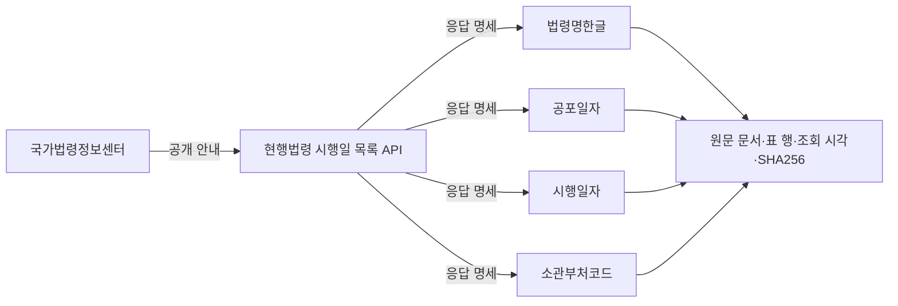

# 국가법령정보센터 메타데이터 수집

2026년 9월 14일 [LAW OPEN DATA 공식 API 가이드 목록](https://open.law.go.kr/LSO/openApi/guideList.do)에 실제로 연결된 안내 195개를 수집했다. **API 기능의 설명서를 모은 것이며, 법령·판례 본문 전체를 내려받은 것은 아니다.**

| 확보한 것 | 수량 | 온톨로지에서의 용도 |
|---|---:|---|
| API 안내와 원래 안내 ID | 195개 | 어느 포털이 어떤 기능을 제공하는지 구분 |
| 응답 명세가 있는 안내 | 180개 | API 기능과 공식 응답 항목 연결 |
| 응답 명세 항목 | 3,210개 | 항목명·설명·자료형·출처를 바탕으로 개념 후보 검토 |
| 요청 인자 | 1,968개 | 검색 조건과 출력 항목을 구분하고 호출 조건 기록 |
| 응답 명세를 관측하지 못한 안내 | 15개 | 다른 공식 명세를 찾아야 할 미해결 목록 |

응답 항목 수는 문서마다 등장하는 행의 합계다. 같은 이름의 반복과 검색 결과 수·페이지 같은 제어 항목도 포함되므로 고유한 분석 변수 3,210개라는 의미는 아니다. 요청 인자는 응답 항목 수에 더하지 않는다.

예를 들어 다음 경로를 근거와 함께 확인할 수 있다.

이 경로는 문서에서 확인한 구조다. 소관부처코드가 다른 포털의 기관 코드와 같은 체계인지, 공포일자와 다른 자료의 기준일을 어떻게 맞출지는 별도 검토해야 한다. 의미 동일성·자료 결합·통계적 상관관계를 승인한 것은 아니다. 제공기관 표기 `법제처`는 안내를 게시한 기관이며, 개별 법령·판례를 생산한 모든 기관을 법제처로 합친 것이 아니다.

사이트별 QA는 실제 관측한 분자와 분모를 저장했다. 안내 조회 성공 195/195, 응답 명세 확보 180/195, 원문 영수증·해시 일치 196/196이다. 관측값을 분석하지 않았으므로 정확도·결측률·최신성에 임의 점수를 부여하지 않는다. 원본 자료의 재사용 조건도 아직 검토하지 않았다.

아래 사항은 그대로 남겨 두었다.

- 목록 화면은 총 191개로 표시하지만 실제 안내 링크는 195개다. 이 차이를 해소하기 전에는 공식 목록 총계와 대조 완료라고 하지 않는다.
- 6개 안내에서 출력 명세의 표 머리글이 `요청변수`로 잘못 표시되어 있다. 출력 명세라는 표 제목을 분류 근거로 기록하고 원래 머리글도 보존했다.
- 목록의 비정상적인 표 병합 9행, 응답 표의 빈 행 1개, 15개 안내의 반복 항목명을 보존했다. 반복 이름에 임의의 중첩 경로를 붙이지 않는다.
- 응답 명세가 없는 15개 안내는 수집 성공이나 칼럼 해당 없음으로 처리하지 않는다. 현재 받은 문서에서 명세가 보이지 않았다는 뜻이다.

로컬 [현행법령 명세 보기](http://127.0.0.1:8766/?record=law-lsEfYdListGuide)에서 확인할 수 있다. 기존 공개 지식 그래프는 이전 고정 스냅샷이므로 이번 수집분이 자동으로 추가되지는 않는다.

재현 및 근거 파일:

- [수집기](collect_law.py)와 [원문·DB 검사기](check_law.py)
- [수집 결과](law-collection-report.json), [목록 QA](law-catalog-report.json), [사이트별 QA와 미해결 목록](law-source-qa.json)
- [원문 대조](law-source-check.json), [DB·HTTP·내보내기 확인](law-import-check.json)
- [등록정보](inventory/law-catalog-records.jsonl.gz), [응답 항목 전체 스냅샷](inventory/law-columns-snapshot.jsonl.gz)

각 안내의 POST 요청 변수 `htmlName`과 원문 영수증을 보존했다. 문서에 있는 예시 API URL은 호출하지 않았다. 저장된 원문을 재사용하므로 같은 수집기를 다시 실행해도 정상 확보한 안내를 다시 내려받지 않는다.
