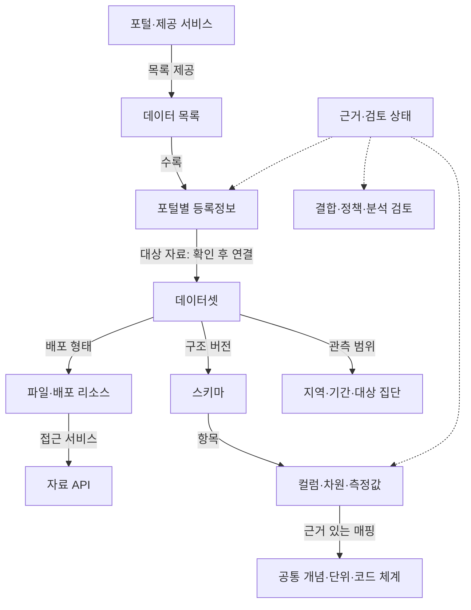

# 여러 공공데이터 포털을 연결하는 온톨로지 설계서

후속 설계: [v0.3 질문·개념·지표 중심 재구성](../discovery-platform/architecture.md). 국내외 범위와 자원 사용량을 제어하는 Harness를 추가했으며 이 문서는 제공처 조사 단계의 설계 기록이다.

설계 버전: v0.2 · 2026-09-12 · 국내 전 분야·전 지역을 대상으로 확장 가능한 공통 구조

이 설계의 목적은 사용자가 필요한 자료의 출처·의미·연결 조건을 확인하도록 하는 것이다. 포털 등록부와 공통 구조를 구현했으며, 각 포털의 모든 데이터셋·컬럼을 확보하거나 통계적 상관관계를 분석한 상태는 아니다.

## 이번 작업에서 만든 것

- **제공처 등록부**: 포털, 통계 서비스, 기관별 API 안내, 대표 누리집을 서로 다른 조사 항목으로 기록했다.
- **조사 모집단과 상태**: 정부24·행정안전부·ALIO의 출처별 항목과 기관 홈페이지 탐색 결과를 연결했다. 중복 기관을 통합하기 전이므로 항목 수를 기관 수로 해석하지 않는다.
- **추가 경로 목록**: 기관 누리집의 데이터 관련 링크를 후보로 기록했다. 공지사항이나 설문 링크가 포함될 수 있어 개별 검토가 필요하다.
- **공통 온톨로지**: 26개 개체 유형과 16개 프로젝트 관계를 정의하고, 실제 등록부의 주제 분류·출처 링크·기관 관계 후보를 RDF로 표현했다.
- **검증 규칙**: 후보를 사실로 내보내거나 페이지 접속을 API 검증으로 과장하지 않도록 검사한다.

## 1. 공통 구조

하나의 웹사이트가 여러 데이터 목록을 제공할 수 있다. API 안내 페이지도 API 자체와 구분한다. 현재 등록부의 조사 항목은 `ServiceEntry`로 표현하고, 실제 데이터 목록이나 API라는 근거가 확보되면 `Catalog` 또는 `DataService`와 연결한다.

표준 표현에는 [W3C DCAT 3](https://www.w3.org/TR/vocab-dcat-3/)를 활용한다. 목록·등록정보·데이터셋·배포형태·접근 서비스의 구분을 따르며, 프로젝트에 필요한 조사·검토 개체를 추가했다. 아래의 필드 선택과 검증 규칙은 프로젝트의 설계 판단이다.

## 2. 어떤 정보를 별도로 저장하는가

| 개체 | 담는 내용 | 구별해야 할 것 |
|---|---|---|
| 포털·제공 서비스 | 명칭, 주소, 역할, 공식 연결 근거, 조사 상태 | 사이트에 접속됨 / 자료가 실제 제공됨 |
| 기관 | 명칭, 출처별 기관 식별자, 조직 변경 이력 | 운영기관 / 자료 생산기관 / 자료 제공기관 |
| 데이터 목록 | 해당 서비스가 관리하는 자료 목록, 분류체계, 수집 경로 | 웹사이트 전체 / 목록 하나 |
| 등록정보 | 원문 제목·설명·제공기관·수정일·이용 조건 표시 | 포털의 설명 / 데이터 자체의 속성 |
| 데이터셋 | 측정 대상, 관측 기간·지역, 모집단, 방법, 버전 | 같은 제목 / 같은 자료 |
| 배포형태·자료 API | 파일 형식·다운로드 경로·API 접근 조건 | API 문서 주소 / 실행할 API 주소 |
| 스키마·컬럼 | 원본 항목명, 자료형, 의미, 역할, 단위, 코드 체계 | 지역코드 같은 식별자 / 인구수 같은 수량 |
| 개념·코드 사전 | 개념 정의, 별칭, 상하위·관련 관계, 코드 기준일 | 문자열 유사성 / 의미의 동일성 |
| 결합 검토 | 공통 키, 기준일, 집계, 중복·누락, 검증 근거 | 연결 후보 / 결합 검증 완료 |
| 정책 검토 | 대상 자료와 요청 행위, 근거 조건, 판단·검토일 | 검색 안내 / 다운로드 / 재배포 / 상업적 이용 |
| 분석 결과 | 입력 버전, 질문, 분석 단위·방법·범위, 추정값·한계 | 관찰된 상관 / 일반적 관계 / 인과관계 |
| 수집·감사 이력 | 수집·수정·승인 주체와 시점, 이전 값과 변경 근거 | 관측일 / 파일 게시일 / 포털 수정일 / 수집일 |

## 3. 여러 포털에 같은 자료가 있을 때

등록정보의 고유키는 `(service_id, source_record_id)`로 잡는다. 데이터셋은 별도의 내부 ID를 사용한다.

예를 들어 포털 A와 포털 B가 동일 자료를 소개한다고 의심되면 다음처럼 처리한다. 이는 처리 방식 예시이며 실제 두 자료의 동일성을 확정한 결과가 아니다.

1. A의 등록정보와 B의 등록정보를 각각 보존한다.
2. 원본 자료 ID, 원본 주소, 생산기관, 제공 기간·방법·버전의 일치 여부를 조사한다.
3. 근거가 부족하면 `candidate` 상태의 대응 관계를 만든다. 데이터셋 ID를 강제로 같게 만들지 않는다.
4. 동일성이 확인되면 두 등록정보를 같은 데이터셋에 연결한다. 각 등록정보의 원문·수정일·조건 표시를 유지한다.
5. 이용 조건이 충돌하면 충돌 내용을 보존하고 자료·요청 행위별로 검토한다.

도메인이 같다는 사실, 제목이 같다는 사실, 링크가 있다는 사실만으로 데이터 동일성이나 자동 동기화를 선언하지 않는다. 현재 RDF에는 `owl:sameAs`를 사용하지 않는다.

## 4. 분야를 넘어서 개념을 연결하는 방법

각 포털의 분류체계를 원래 이름과 코드로 보존한다. 공통 개념 사전은 별도의 식별자를 가진다. [SKOS](https://www.w3.org/TR/skos-primer/)의 개념·개념체계·상하위·관련 표현을 참고한다.

| 원본 항목의 예시 | 공통 개념 후보 | 확인할 조건 |
|---|---|---|
| 병원 자료의 소재지주소 | 시설의 주소 | 도로명/지번, 우편주소/실제 위치 구분 |
| 학교 자료의 학교코드 | 교육기관 식별자 | 교육기관 코드의 발급 주체·버전 |
| 인구 통계의 지역코드 | 통계의 공간 구분 | 행정동/법정동/통계구역, 코드 기준일 |
| 기상 자료의 관측소번호 | 관측시설 식별자 | 관측소 종류, 위치 변경 이력 |
| 고용 자료의 청년 연령구간 | 대상 집단의 연령 조건 | 자료별 청년 정의와 조사 시점 |

표의 항목은 설계 설명용 예시다. 실제 API 컬럼명이나 검증된 매핑으로 등록하지 않았다. 같은 '주소'라도 다른 역할일 수 있으므로 정의·측정 대상·설명서를 함께 확인한다. 주소나 좌표를 공간 구역에 연결할 때는 좌표체계와 경계 버전도 기록한다.

## 5. 관계 정의서의 규칙

| 관계 유형 | 근거 | 확인 후 가능한 동작 |
|---|---|---|
| 페이지에서 다른 제공처로 안내 | 실제 하이퍼링크와 조회 출처 | 출처 경로 안내 |
| 서비스의 운영기관 | 운영·소개 문구에 명시된 역할 | 운영기관 정보 표시 |
| 자료가 특정 주제를 다룸 | 공식 자료 설명과 편집자의 분류 근거 | 관련 자료 검색 |
| 컬럼이 개념을 표현 | 원본 컬럼과 정의·단위·코드 설명 | 의미 기반 검색·매핑 제안 |
| 동일 자료 등록 후보 | 원본 ID·주소·버전 비교 | 중복 검토 대상으로 묶기 |
| 결합 후보 | 시간·공간·키·대상 범위의 검토 | 결합에 필요한 추가 자료 안내 |
| 결합 검증 완료 | 실제 결합과 누락·중복·방법 검증 | 검증 범위에 한정한 결합 실행 |
| 분석에서 관찰된 관계 | 입력 버전·실행 코드·방법·범위·결과 | 해당 분석 조건과 함께 결과 설명 |

모든 관계 주장에는 주어·관계·목적어, 근거, 확인일, 상태, 적용 범위를 둔다. 상태는 `documented`(자료로 확인), `curated`(편집 판단), `candidate`(후보), `rejected`(기각), `superseded`(이전 판단)로 관리한다.

현재 등록부의 기관 표기는 보수적으로 처리했다. '운영기관'을 명시한 부산 사례는 운영 관계로 표현하고, 저작권·연락처에 나타난 기관은 역할을 더 확인할 후보로 기록했다. 기관이 등장했다는 사실과 운영 역할을 동일하게 취급하지 않는다.

## 6. 전체 자료의 구조를 어떻게 조사하는가

| 자료 형태 | 수집할 구조 정보 |
|---|---|
| 표형 파일 | 헤더, 자료형, 설명, 단위, 코드·결측 표기, 파일 버전 |
| 통계표 | 차원, 측정항목, 계층·합계 행, 단위, 집계 주기 |
| API | API 문서, 요청·응답 항목의 구분, 페이지 처리, 응답 스키마, 코드 설명 |
| 공간자료 | 속성 필드, 도형 유형, 좌표체계, 공간 단위와 경계 버전 |
| 문서·이미지·영상 | 형식, 내용 설명, 주제, 언어·촬영/제작 범위, 제공 조건 |

필드가 없는 비표형 자료에는 `not_applicable`, 아직 읽지 못한 구조에는 `not_verified`를 기록한다. 자료가 없다고 삭제하거나 LLM이 추측한 컬럼을 채워 넣지 않는다. 원본 전체 행을 저장하지 않아도 컬럼 설명·API 문서·헤더·필요한 표본으로 구조를 조사할 수 있다. 품질 통계를 산출할 때에는 표본인지 전량인지 별도로 명시한다.

## 7. 추천·하네스·감사 이력과 연결

1. 자연어 해석은 질의의 대상 개념·지역·기간·목적을 구조화한다.
2. 온톨로지는 조건과 관련된 제공처·자료 및 연결 후보를 조회한다.
3. 추천 결과에는 선택 이유, 공식 출처, 연결 조건, 미확인 항목을 붙인다.
4. 하네스는 실제 요청 행위를 기준으로 접근 조건·이용 조건·품질·개인정보 검토 결과를 확인한다. 자료를 검색할 수 있다는 사실을 재배포 승인으로 취급하지 않는다.
5. 자료 제공이나 결과 생성 시 입력 버전과 정책 판단 근거를 기록한다.

현재 구현한 것은 조사 등록부와 관계 구조다. 실제 LLM 추천·정책 집행·데이터 제공은 후속 구현 범위다. [PROV-O](https://www.w3.org/TR/prov-o/)는 자료·실행·행위자의 출처 관계 표현에 참고했으며, 변경 불가능한 감사 저장소까지 구현했다는 뜻은 아니다.

## 8. 개발자가 사용할 저장 단위

초기 구현에서는 일반 관계형 DB로 다음 테이블을 만들 수 있다. RDF는 교환·질의용 산출물로 함께 유지할 수 있으며 별도 그래프 DB를 필수로 요구하지 않는다.

- `services`, `organizations`, `service_organization_claims`
- `catalogs`, `catalog_records`, `datasets`, `dataset_versions`, `distributions`, `data_services`
- `schemas`, `fields`, `concept_schemes`, `concepts`, `field_mappings`
- `spatial_extents`, `temporal_extents`, `code_schemes`, `units`
- `relationship_claims`, `source_evidence`, `collection_runs`
- `join_assessments`, `policy_assessments`, `analysis_results`, `audit_events`

이 테이블 목록은 설계이며 DB를 생성한 상태는 아니다. 원문 응답은 출처별로 보존하고, 정규화 필드에는 원문 경로와 변환 규칙을 연결한다. 수집일과 조회 경로를 보존해 원본 변경 시 재검토 대상을 찾을 수 있게 한다.

## 9. 확인할 대표 질문

1. 특정 분야의 자료를 제공하는 포털과 공식 안내 경로는 어디인가?
2. 특정 지역의 제공처 중 본문을 확인한 곳과 아직 확인하지 못한 곳은 어디인가?
3. API 안내 링크만 발견한 곳과 실제 자료 API를 검증한 곳을 구별할 수 있는가?
4. 같은 자료로 의심되는 두 등록정보를 합치지 않고 후보로 보존할 수 있는가?
5. 제공기관과 운영기관의 근거·역할을 별도로 설명할 수 있는가?
6. 같은 지역코드 이름을 쓰지만 코드 체계가 다른 자료의 결합을 보류할 수 있는가?
7. 서로 다른 관측 기간·공간 단위·모집단을 가진 자료의 연결 조건을 설명할 수 있는가?
8. 출처에서 종료·이전 안내가 발견되면 이전 판단과 새 근거를 함께 남길 수 있는가?

1~3번의 제공처 조회 기반과 4~5번의 상태·표현 규칙을 이번 산출물에 반영했다. 데이터셋 수준의 6~8번은 원본·설명서 확보 이후 검증할 항목이다.

## 10. 다음 실행 작업

1. `navigation-review-queue.json`의 경로 후보를 검토해 실제 목록·문서·포털과 공지·설문을 구분한다.
2. 기관별 미조사 영역을 보완한다. 대학 개별 목록, 지방공공기관 목록, 중앙기관 소속기관 전체 목록은 별도 확보가 필요하다.
3. 등록부의 `navigation_candidates`를 따라 포털별 전체 목록 수집 명세를 작성한다. 인증 여부와 호출 조건은 공식 문서에서 확인한다.
4. 각 포털의 모든 등록정보를 수집하되, 원본 ID·원문·수집일·수정일·실패 상태를 보존한다.
5. 모든 자료의 구조 확보 상태와 개념 매핑 상태를 관리한다. 미확인 항목에 우선순위를 붙여 검토를 이어간다.

분야와 지역은 전체 범위로 유지한다. 각 단계를 순차 실행하는 것은 운영상 작업 순서이며, 전체 범위를 특정 분야로 축소한다는 뜻이 아니다.
